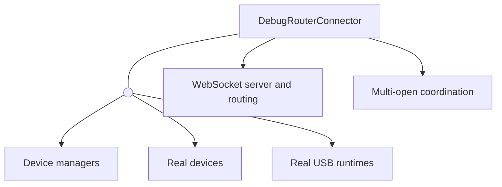
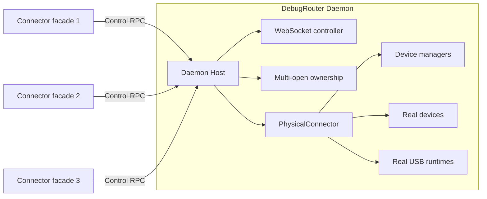

# PhysicalConnector Architecture Design

## Overview

`PhysicalConnector` is the DebugRouter Daemon component that manages real
devices and the USB DebugRouter runtimes running on them. It is a new boundary
introduced by the Multiplexer architecture; the legacy architecture had no
equivalent standalone component.

The legacy `DebugRouterConnector` was designed for a single Connector process,
so it could own both the caller-facing API and the physical connections. In the
Multiplexer architecture, multiple Connector facades share one Daemon. Real
devices cannot be owned independently by every facade: doing so would duplicate
device discovery, start competing watchers, and create conflicting runtime
connections.

`PhysicalConnector` gives these physical resources one owner inside the Daemon.
It also separates device-specific connection work from the Host's daemon-wide
coordination and routing policy.

## Legacy Architecture

In the legacy architecture, `DebugRouterConnector` directly owned the public
API, WebSocket and routing behavior, multi-open coordination, and physical
connections.

Because the physical connection lifecycle belonged to the Connector itself,
this structure could not safely represent several callers sharing the same
devices.

## Multiplexer Architecture

Multiplexer gives each kind of responsibility a separate owner: Connector
facades represent callers, the Daemon Host coordinates shared behavior, and
`PhysicalConnector` manages the real physical resources.

| Component | Role |
| --- | --- |
| Connector facade | Exposes the public API and keeps state local to one caller. |
| Daemon Host | Coordinates all callers and owns routing, WebSocket, ownership, and recovery policy. |
| PhysicalConnector | Discovers devices and owns the real Device and USB runtime connections. |

A Connector facade never accesses a real Device or `UsbClient` directly. It
sends a control request to the Host. The Host decides whether the requested
shared operation should run, then delegates the physical action to
`PhysicalConnector` and distributes the resulting state to callers.

## PhysicalConnector Boundary

`PhysicalConnector` is responsible for:

- creating platform device managers and discovering devices;
- owning the Daemon's real Device and `UsbClient` objects;
- starting and stopping physical runtime watchers;
- reporting physical connection, disconnection, and message events to the Host;
- querying and closing physical resources on behalf of the Host.

It is intentionally not responsible for:

- public Connector APIs or caller-local state;
- WebSocket lifecycle or cross-connection message routing;
- multi-open ownership, daemon recovery, or other global policy.

## Why It Is Separate from the Host

The Host needs a global view of all callers and connections, while physical
device access is platform-specific implementation work. Keeping
`PhysicalConnector` separate provides three benefits:

- **Single ownership:** one Daemon component owns each real device and runtime.
- **Clear policy boundary:** the Host decides **whether** an operation should
  happen; `PhysicalConnector` knows **how** to perform it.
- **Platform isolation:** Android, iOS, Harmony, desktop, and network discovery
  details do not leak into routing and ownership logic.

The result is a small physical resource layer that the Host can coordinate
without becoming coupled to each platform's connection implementation.

For the complete Multiplexer architecture, see
[`DebugRouter Multiplexer Technical Design.md`](./DebugRouter%20Multiplexer%20Technical%20Design.md).
