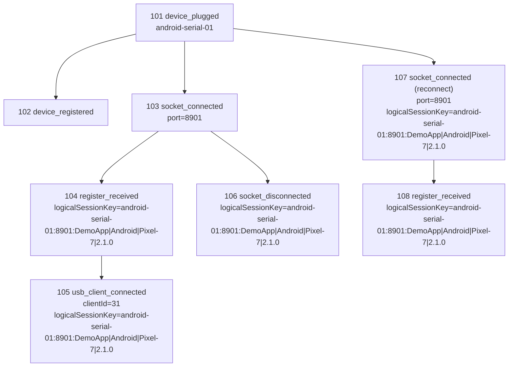

# Plan: Connection process tree logging (delta)

## Status
The core connector tracing baseline is already implemented in `debug_router_connector`:
- Dedicated recorder and sink abstraction are in place.
- Device, socket, register, USB client, app client, and websocket lifecycle events are instrumented.
- Trace gate is configurable via options/env.

This document now tracks only delta work and finalized design decisions.

## Finalized decisions
- Desktop devices use a synthetic `device_plugged` root before `registerDevice`.
- WebSocket clients stay in an independent tree and are not attached to device trees.
- Reconnect model is hybrid:
  - Physical history: each reconnect creates a new branch.
  - Logical readability: reconnect-relevant nodes carry `logicalSessionKey` for dashboard stitching.
- Logical session identity is `deviceId + port + appSignature`.
- Trace is exposed through debug-router APIs so apps can fetch/export and upload to dashboard platforms.
- Reconnect/disconnect events are kept at full fidelity (no local suppression).

## Delta workplan
- [x] Align Desktop with synthetic root semantics in `DesktopDeviceManager`.
- [x] Add `logicalSessionKey` metadata support for hybrid reconnect modeling in `ConnectionTraceRecorder`.
- [x] Expose app-facing connector trace APIs for snapshot retrieval and live subscription.
- [x] Add explicit API documentation for app usage (snapshot pull + listener stream + schema compatibility notes).
- [ ] Add schema version and field contract section to public docs (`traceSchemaVersion`, `logicalSessionKey`).
- [ ] Add connector tests/smoke verification for reconnect lineage and trace API behavior.

## API and schema notes
- Output remains structured JSON lines from recorder sink.
- Nodes now include `traceSchemaVersion`.
- Reconnect-related nodes include `logicalSessionKey` where app signature is available.
- Dashboard should support two modes:
  - Logical timeline mode (group by `logicalSessionKey`).
  - Raw forensic mode (show physical reconnect branches).

## Trace API usage (app side)

### 1) Enable trace when creating connector

```ts
import { DebugRouterConnector } from "@lynx-js/debug-router-connector";

const connector = new DebugRouterConnector({
  connectionTrace: {
    enabled: true,
    output: "/tmp/debug-router-trace.jsonl",
    bufferSize: 5000,
  },
});
```

### 2) Pull a snapshot for upload

`getConnectionTrace(limit?: number)` returns recent nodes from in-memory buffer.

```ts
const snapshot = connector.getConnectionTrace(2000);

// App upload example
await uploadToDashboard({
  traceSchemaVersion: 1,
  generatedAt: new Date().toISOString(),
  records: snapshot,
});
```

### 3) Subscribe to live trace stream

`onConnectionTrace(listener)` provides real-time nodes. It returns an unsubscribe function.

```ts
const unsubscribe = connector.onConnectionTrace((node) => {
  // Push to local queue/batcher, then upload periodically.
  traceQueue.push(node);
});

// later
unsubscribe();
```

### API behavior notes
- If trace is disabled, `getConnectionTrace()` returns `[]` and `onConnectionTrace()` returns a no-op unsubscribe.
- Recommended upload model:
  - real-time: stream nodes via listener with batching.
  - fallback: periodic snapshot pull via `getConnectionTrace(limit)`.

## Example trace (JSON lines)

Below is a realistic USB reconnect sequence for one device/app. It shows:
- New physical branch after reconnect (`socket_connected` with new node id).
- Stable logical stitching key via `logicalSessionKey`.

```json
{"id":"101","event":"device_plugged","deviceId":"android-serial-01","timestamp":"2026-03-27T09:21:10.003Z","traceSchemaVersion":1,"metadata":{"deviceId":"android-serial-01","os":"Android","event":"add"}}
{"id":"102","parentId":"101","event":"device_registered","deviceId":"android-serial-01","timestamp":"2026-03-27T09:21:10.020Z","traceSchemaVersion":1,"metadata":{"os":"Android","title":"Pixel-7"}}
{"id":"103","parentId":"101","event":"socket_connected","deviceId":"android-serial-01","timestamp":"2026-03-27T09:21:10.180Z","traceSchemaVersion":1,"metadata":{"port":8901,"os":"Android"}}
{"id":"104","parentId":"103","event":"register_received","deviceId":"android-serial-01","timestamp":"2026-03-27T09:21:10.205Z","traceSchemaVersion":1,"metadata":{"port":8901,"app":"DemoApp","os":"Android","deviceModel":"Pixel-7","sdkVersion":"2.1.0","appSignature":"DemoApp|Android|Pixel-7|2.1.0","logicalSessionKey":"android-serial-01:8901:DemoApp|Android|Pixel-7|2.1.0"}}
{"id":"105","parentId":"104","event":"usb_client_connected","deviceId":"android-serial-01","timestamp":"2026-03-27T09:21:10.250Z","traceSchemaVersion":1,"metadata":{"clientId":31,"port":8901,"app":"DemoApp","os":"Android","deviceModel":"Pixel-7","sdkVersion":"2.1.0","appSignature":"DemoApp|Android|Pixel-7|2.1.0","logicalSessionKey":"android-serial-01:8901:DemoApp|Android|Pixel-7|2.1.0"}}
{"id":"106","parentId":"103","event":"socket_disconnected","deviceId":"android-serial-01","timestamp":"2026-03-27T09:21:14.990Z","traceSchemaVersion":1,"metadata":{"port":8901,"os":"Android","logicalSessionKey":"android-serial-01:8901:DemoApp|Android|Pixel-7|2.1.0"}}
{"id":"107","parentId":"101","event":"socket_connected","deviceId":"android-serial-01","timestamp":"2026-03-27T09:21:15.210Z","traceSchemaVersion":1,"metadata":{"port":8901,"os":"Android","logicalSessionKey":"android-serial-01:8901:DemoApp|Android|Pixel-7|2.1.0"}}
{"id":"108","parentId":"107","event":"register_received","deviceId":"android-serial-01","timestamp":"2026-03-27T09:21:15.238Z","traceSchemaVersion":1,"metadata":{"port":8901,"app":"DemoApp","os":"Android","deviceModel":"Pixel-7","sdkVersion":"2.1.0","appSignature":"DemoApp|Android|Pixel-7|2.1.0","logicalSessionKey":"android-serial-01:8901:DemoApp|Android|Pixel-7|2.1.0"}}
```

## Example trace (tree view)

The same example can be visualized as a connection tree:

```text
device_plugged [101] (android-serial-01)
|- device_registered [102]
|- socket_connected [103] (port=8901)
|  |- register_received [104]
|  |  `- usb_client_connected [105] (clientId=31)
|  `- socket_disconnected [106]
`- socket_connected [107] (port=8901, reconnect)
  `- register_received [108]

logicalSessionKey
android-serial-01:8901:DemoApp|Android|Pixel-7|2.1.0
```

Mermaid version:



## Verification checklist
- [ ] Trace enabled + disabled behavior parity (no functional regressions).
- [ ] Desktop flow emits `device_plugged` before `device_registered`.
- [ ] Same device/port/app reconnect emits new physical branch each time.
- [ ] `logicalSessionKey` is stable across reconnects for the same app signature.
- [ ] WebSocket trees remain independent (no accidental `deviceId` linkage).

## Later phases
- Mirror schema in native Android/iOS/Harmony and `remote_debug_driver` for end-to-end connection tracing.
