# DebugRouter Multiplexer Connector 拆分类图

## 1. 拆分边界

- 更新后的 `DebugRouterConnector` 保留接入方可见 API、事件订阅、镜像对象缓存、daemon 连接管理和旧多开逻辑的回退入口。
- `MultiplexerDaemon` 表达 detached daemon 进程本身，负责 daemon lock、discovery 文件、heartbeat 和 Host 生命周期。
- `MultiplexerDaemonManager` 运行在 connector 侧，负责 spawn lock 抢占、daemon 拉起、启动超时控制和 stale daemon 清理。
- `MultiplexerDiscovery` 只负责读取和校验 `daemon.json`，不直接负责拉起 daemon。
- `MultiplexerHost` 运行在 mux daemon 内，持有 control server、WebSocket server、消息路由和 message id 重写能力。
- `MultiplexerControlServer` 运行在 mux daemon 内，负责 health endpoint、control WebSocket、token 校验、control client 连接管理和事件广播。
- `MultiplexerControlConnection` 表达一条 connector client 到 daemon 的 control WebSocket 连接，持有 controlId、socket、pending RPC 和断开清理状态。
- `PhysicalConnector` 是包内共享真实连接层，持有真实设备发现、真实 SDK runtime 连接和物理 client 生命周期能力；mux daemon 和 mux disabled 的 legacy fallback 都通过组合复用它。
- `MultiplexerRemoteClient` 是 connector 到 daemon control WebSocket 的本地代理。
- `MultiplexerDevice`、`MultiplexerUsbClient` 是 connector 进程内的镜像/代理对象，不直接启动真实 device watcher 或 runtime client watcher。
- `LegacyMultiOpenGuard` 只在关闭 Multiplexer 后启用，用于承接旧版 `LatestDriverProcess` 多开抢占逻辑。

## 2. 核心类职责

- `DebugRouterConnector`: 对外保持旧 connector 使用方式；mux enabled 时通过 remote client 调用 daemon RPC 并维护本地镜像，mux disabled 时组合 `PhysicalConnector` 保留旧真实连接路径。
- `MultiplexerDaemonManager`: connector 侧 daemon 管理器，负责发现不存在或过期时抢 `spawn.lock`、启动 detached daemon、等待 ready、清理 stale lock/discovery。
- `MultiplexerDiscovery`: connector 侧只读发现组件，负责读取 `daemon.json`、校验协议版本、token、controlPort 和 heartbeat 新鲜度。
- `MultiplexerRemoteClient`: 负责通过 daemon manager 获取可用 daemon，并建立 control WebSocket、维护 connector 侧 RPC pending、处理 snapshot/event 分发。
- `MultiplexerDaemon`: daemon 进程入口，负责持有 `daemon.lock`、写入/刷新 `daemon.json`、维护 heartbeat timer，并启动/停止 `MultiplexerHost`。
- `MultiplexerHost`: daemon 内的控制面和路由层，负责 control RPC 分发、WebSocket 前端接入、pending route、message id rewrite 和事件广播，不直接展开物理连接查询/监听方法。
- `MultiplexerControlServer`: daemon 内 control server，负责 `/health`、`/debug-router-multiplexer/control`、token 校验、control connection 管理和事件 broadcast。
- `MultiplexerControlConnection`: daemon 内单条 control WebSocket 连接，负责 controlId、socket 读写、订阅状态、连接级 pending 清理和关闭通知。
- `PhysicalConnector`: 包内共享物理连接层，负责真实设备发现、真实 runtime client 注册注销、设备/client 查询过滤和物理连接关闭；不直接发出 connector 兼容事件，调用方负责把 physical event 转换成旧事件或 control event。
- `MultiplexerDevice`: connector 侧设备镜像，保留 `BaseDevice` 兼容外形，`startWatchClient()` 不做真实监听。
- `MultiplexerUsbClient`: connector 侧 runtime client 镜像，保留 `UsbClient/Client` 兼容方法，发送能力委托给 `MultiplexerRemoteClient`。
- `LegacyMultiOpenGuard`: 保存 `multiOpenCallback`、`currentStatus`、monitor timer 等旧多开状态，只服务 mux disabled 的 legacy 分支。

## 3. Mermaid 类图

```mermaid
classDiagram
  direction LR

  class DebugRouterConnector {
    -EventEmitter events
    -DriverReportService reportService
    -Map~string, MultiplexerDevice~ devices
    -Map~number, MultiplexerUsbClient~ usbClients
    -MultiplexerRemoteClient remoteClient
    -LegacyMultiOpenGuard legacyMultiOpenGuard
    -PhysicalConnector physicalConnector
    -DriverClient driverClient
    -ConnectionTraceRecorder traceRecorder
    -boolean manualConnect
    -boolean enableWebSocket
    -MultiplexerUsbClient selectedClient
    -NetworkDeviceOption networkDeviceOpt
    -AdbHostPort adbOption
    -HdcHostPort hdcOption
    -UsbConnectOption usbConnectOpt
    -boolean closed
    -number wssPort
    -string wssHost
    -string roomId
    +constructor(option)
    +setMultiOpenCallback(callback) void
    +connectDevices(timeout, serial, isAutoListenClients) Promise~MultiplexerDevice[]~
    +connectUsbClients(deviceId, timeout, waitTimeout, clientName) Promise~MultiplexerUsbClient[]~
    +selecteUsbClient(id) void
    +getDevices(timeout, serial) Promise~MultiplexerDevice[]~
    +getAllUsbClients() MultiplexerUsbClient[]
    +getDeviceUsbClients(deviceId, timeout, clientName) Promise~MultiplexerUsbClient[]~
    +registerDevice(device: MultiplexerDevice) void
    +unregisterDevice(serial) void
    +regiserUsbClient(client: MultiplexerUsbClient) void
    +unregiserUsbClient(id) void
    +startWatchAllClients(force) Promise~void~
    +startWSServer() Promise~void~
    +sendMessageToWeb(message) Promise~void~
    +sendMessageToApp(id, message) Promise~void~
    +on(event, callback) void
    +off(event, callback) void
    +emit(event, payload) void
    +getConnectionTrace(limit) ConnectionTraceNode[]
    +onConnectionTrace(listener) Function
    +close() Promise~void~
    +getDriverClient() DriverClient
    -applySnapshot(snapshot) void
    -applyHostEvent(event) void
    -findDevice(serial) MultiplexerDevice[]
    -findUsbClient(clientName, clients: MultiplexerUsbClient[]) MultiplexerUsbClient[]
    -isTargetClient(client: MultiplexerUsbClient, clientName) boolean
    -waitDeviceUsbCliens(deviceId, timeout) Promise~MultiplexerUsbClient[]~
    -setOptionByEnv() void
  }

  class MultiplexerRemoteClient {
    -MultiplexerDaemonManager daemonManager
    -WebSocket controlSocket
    -Map~number, PendingRpc~ pendingRpc
    -boolean ready
    +connect() Promise~void~
    +call(method, params) Promise~any~
    +subscribe(listener) void
    +reconnect() Promise~void~
    +close() Promise~void~
    -handleSnapshot(snapshot) void
    -handleHostEvent(event) void
    -rejectPending(error) void
  }

  class MultiplexerDiscovery {
    +readDiscovery() MultiplexerDiscoveryInfo
    +validateDiscovery(info) boolean
    +isFresh(info) boolean
    +getFreshDiscovery() MultiplexerDiscoveryInfo
  }

  class MultiplexerDaemonManager {
    -MultiplexerDiscovery discovery
    -FileLock spawnLock
    -number startupTimeout
    +ensureDaemon() Promise~MultiplexerDiscoveryInfo~
    +spawnDaemon() Promise~void~
    +waitUntilReady(timeout) Promise~MultiplexerDiscoveryInfo~
    +cleanupStaleDaemon() void
    +acquireSpawnLock() boolean
    +releaseSpawnLock() void
  }

  class MultiplexerDaemon {
    -FileLock daemonLock
    -MultiplexerHost host
    -MultiplexerDiscoveryInfo discoveryInfo
    -Timer heartbeatTimer
    -string token
    -number controlPort
    +start(option) Promise~void~
    +stop() Promise~void~
    +writeDiscovery() void
    +refreshHeartbeat() void
    +removeDiscovery() void
    +holdDaemonLock() void
    +releaseDaemonLock() void
  }

  class MultiplexerHost {
    -DriverReportService reportService
    -PhysicalConnector physicalConnector
    -MultiplexerControlServer controlServer
    -WebSocketController webSocketController
    -PendingRouteTable pendingRoutes
    -ConnectionTraceRecorder traceRecorder
    -number wssPort
    -string wssHost
    -string roomId
    -number nextGlobalMessageId
    -number nextClientId
    +constructor(option)
    +start() Promise~void~
    +stop() Promise~void~
    +startWSServer() Promise~void~
    +handleControlRpc(method, params, controlId) Promise~any~
    +handleWebSocketMessage(webClientId, targetClientId, message) void
    +handlePhysicalMessage(clientId, message) void
    +sendMessageToWeb(message) void
    +sendMessageToWebClient(webClientId, message) void
    +sendMessageToApp(id, message, fromWebClientId) void
    +createClientId() number
    +broadcast(event) void
    -rewriteOutboundMessage(message, target) string
    -restoreInboundMessage(message) RoutedMessage
    -publishSnapshot() void
    -publishPhysicalEvent(event) void
    -serializeDevices(devices) DeviceSnapshot[]
    -serializeClients(clients) ClientSnapshot[]
  }

  class MultiplexerControlServer {
    -MultiplexerHost host
    -Map~number, MultiplexerControlConnection~ connections
    -string token
    -number controlPort
    -string healthPath
    -string controlPath
    +start(port, token) Promise~void~
    +stop() Promise~void~
    +handleHealth(request, response) void
    +handleUpgrade(request, socket) void
    +validateToken(request) boolean
    +registerConnection(socket) MultiplexerControlConnection
    +unregisterConnection(controlId) void
    +dispatchRpc(controlId, message) Promise~void~
    +broadcast(event) void
    +sendToControl(controlId, event) void
  }

  class MultiplexerControlConnection {
    -number controlId
    -WebSocket socket
    -Map~number, PendingRpc~ pendingRpc
    -boolean subscribed
    -boolean closed
    +send(event) void
    +sendResponse(rpcId, result) void
    +sendError(rpcId, error) void
    +handleMessage(message) void
    +subscribe() void
    +unsubscribe() void
    +close() void
    -rejectPending(error) void
    -handleClose() void
  }

  class PhysicalConnector {
    -DriverReportService reportService
    -Map~string, BaseDevice~ devices
    -Map~number, UsbClient~ usbClients
    -Set~DeviceManager~ deviceManagers
    -ConnectionTraceRecorder traceRecorder
    -boolean manualConnect
    -boolean enableAndroid
    -boolean enableIOS
    -boolean enableHarmony
    -boolean enableDesktop
    -boolean enableNetworkDevice
    -NetworkDeviceOption networkDeviceOpt
    -AdbHostPort adbOption
    -HdcHostPort hdcOption
    -UsbConnectOption usbConnectOpt
    +constructor(option)
    +connectDevices(timeout, serial, isAutoListenClients) Promise~BaseDevice[]~
    +getDevices(timeout, serial) Promise~BaseDevice[]~
    +connectUsbClients(deviceId, timeout, waitTimeout, clientName) Promise~UsbClient[]~
    +startWatchAllClients(force) Promise~void~
    +addDeviceManager(manager) void
    +registerDevice(device: BaseDevice) void
    +unregisterDevice(serial) void
    +regiserUsbClient(client: UsbClient) void
    +unregiserUsbClient(id) void
    +getAllUsbClients() UsbClient[]
    +getDeviceUsbClients(deviceId, timeout, clientName) Promise~UsbClient[]~
    +getAllPhysicalClients() UsbClient[]
    +sendMessage(clientId, message) void
    +sendRawMessage(clientId, message) Promise~ResponseMessageType~
    +closeClient(clientId) void
    +disableAllClients() void
    +on(event, callback) void
    +off(event, callback) void
    -startDeviceListeners() Promise~void~
    -findDevice(serial) BaseDevice[]
    -findUsbClient(clientName, clients: UsbClient[]) UsbClient[]
    -isTargetClient(client: UsbClient, clientName) boolean
    -waitDeviceUsbCliens(deviceId, timeout) Promise~UsbClient[]~
    -setOptionByEnv() void
  }

  class LegacyMultiOpenGuard {
    -MultiOpenCallback multiOpenCallback
    -boolean monitoring
    -Timer multiOpenMonitorTimer
    -MultiOpenStatus currentStatus
    +setMultiOpenCallback(callback) void
    +prepareDriverDataDir() void
    +startMonitorMultiOpen() void
    +monitorLatestDriverProcessFile() void
    +stop() void
    -updateLatestProcess() void
    -monitorLatestDriverProcessFileSafely() void
  }

  class PendingRouteTable {
    -Map~number, PendingTarget~ routes
    +addControlRoute(globalId, controlId, originalId, resolve, reject, timer) void
    +addWebSocketRoute(globalId, webClientId, originalId) void
    +take(globalId) PendingTarget
    +remove(globalId) void
    +clearByControlId(controlId) void
  }

  class MultiplexerDevice {
    +DeviceDescription info
    -MultiplexerRemoteClient remoteClient
    +serial string
    +startWatchClient() void
    +stopWatchClient() void
    +disConnect() void
  }

  class MultiplexerUsbClient {
    +ClientDescription info
    -MultiplexerRemoteClient remoteClient
    -EventEmitter events
    +clientId() number
    +deviceId() string
    +sendCustomizedMessage(method, params, sessionId, type) Promise~string~
    +sendRawMessage(message) Promise~ResponseMessageType~
    +sendMessage(message) void
    +sendClientMessage(method, params) Promise~string~
    +close() Promise~void~
    +on(event, callback) void
    +onAllEvents(callback) void
    +once(event, callback) void
    +off(event, callback) void
  }

  class WebSocketController {
    <<external>>
  }

  class DeviceManager {
    <<external>>
  }

  class BaseDevice {
    <<external>>
  }

  class UsbClient {
    <<external>>
  }

  class DeviceSnapshot {
    <<dto>>
  }

  class ClientSnapshot {
    <<dto>>
  }

  class DriverClient {
    <<external>>
  }

  class ConnectionTraceRecorder {
    <<external>>
  }

  DebugRouterConnector *-- MultiplexerRemoteClient : owns
  DebugRouterConnector *-- LegacyMultiOpenGuard : legacy fallback when mux disabled
  DebugRouterConnector o-- PhysicalConnector : legacy physical fallback when mux disabled
  DebugRouterConnector o-- MultiplexerDevice : mirrors devices
  DebugRouterConnector o-- MultiplexerUsbClient : mirrors runtime clients
  DebugRouterConnector --> DriverClient : exposes identity
  DebugRouterConnector --> ConnectionTraceRecorder : records local events

  MultiplexerRemoteClient --> MultiplexerDaemonManager : ensures daemon
  MultiplexerRemoteClient ..> MultiplexerHost : control RPC / events
  MultiplexerRemoteClient --> DebugRouterConnector : snapshot and host events

  MultiplexerDaemonManager --> MultiplexerDiscovery : reads discovery
  MultiplexerDaemonManager ..> MultiplexerDaemon : spawns detached process
  MultiplexerDaemon *-- MultiplexerHost : owns host lifecycle

  MultiplexerDevice --> MultiplexerRemoteClient : no physical watcher
  MultiplexerUsbClient --> MultiplexerRemoteClient : delegates send and close

  MultiplexerHost *-- MultiplexerControlServer : owns control entry
  MultiplexerHost *-- PendingRouteTable : owns route state
  MultiplexerHost *-- PhysicalConnector : delegates shared physical connection
  MultiplexerHost *-- WebSocketController : owns web frontend entry
  MultiplexerHost --> ConnectionTraceRecorder : records routing lifecycle
  MultiplexerHost ..> DeviceSnapshot : serializes devices
  MultiplexerHost ..> ClientSnapshot : serializes runtime clients
  MultiplexerHost ..> DebugRouterConnector : emits compatible event model through remote

  MultiplexerControlServer o-- MultiplexerControlConnection : manages connections
  MultiplexerControlServer --> MultiplexerHost : dispatches RPC
  MultiplexerControlConnection --> MultiplexerControlServer : forwards messages

  PhysicalConnector *-- DeviceManager : owns physical watchers
  PhysicalConnector --> ConnectionTraceRecorder : records physical lifecycle
  PhysicalConnector o-- BaseDevice : authoritative devices
  PhysicalConnector o-- UsbClient : authoritative runtime clients
```

