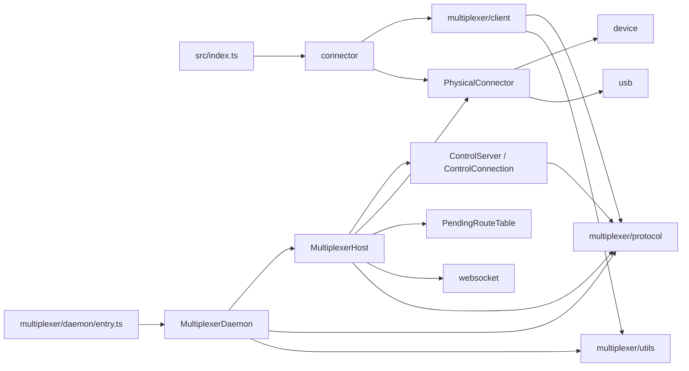

# DebugRouter Multiplexer 开发文件目录规划

本文基于以下设计文档规划 Multiplexer 的开发文件目录：

- `DebugRouter Multiplexer Connector 拆分类图.md`
- `DebugRouter Multiplexer 接口清单.md`
- `debug_router_connector/src` 当前代码结构

目录规划以进程边界和依赖方向为主要拆分依据。目标是让 connector 进程、daemon 进程和跨进程协议之间保持明确边界，同时尽量复用现有设备、USB、WebSocket、上报和 trace 实现，降低首阶段迁移风险。

## 1. 目录拆分原则

- `connector/` 只保留接入方兼容入口和关闭 Multiplexer 时的 legacy fallback。
- `multiplexer/client/` 只运行在 connector 进程，持有 daemon 代理和镜像对象，不依赖真实 `BaseDevice`、`UsbClient`。
- `multiplexer/daemon/` 只运行在 detached daemon 进程，负责 daemon 生命周期、控制面和消息路由；真实连接能力通过 `physical/PhysicalConnector` 组合进入。
- `multiplexer/protocol/` 只定义可序列化的跨进程数据和运行时校验，不引用 socket、timer、callback、真实设备对象。
- `multiplexer/utils/` 存放 daemon 发现和生命周期需要的通用文件系统能力。
- `physical/` 存放真实设备发现、真实 runtime client 管理和物理消息发送能力，可被 mux daemon 和 legacy fallback 共同复用。
- 现有 `device/`、`usb/`、`websocket/` 首阶段保留原目录，由 `PhysicalConnector` 和 `MultiplexerHost` 复用。
- internal 字段、方法和仅服务单个类的类型直接定义在对应类文件中，并使用 `private` 或 `protected`，不新建 `*Internal` 接口文件。
- 包根入口 `src/index.ts` 不导出 daemon 实现、控制服务和物理连接实现。

## 2. 推荐目标目录

标记说明：

- `[新增]`：Multiplexer 实现需要新增的文件。
- `[改造]`：现有文件保留原路径，但需要调整职责或依赖。
- `[迁移]`：从现有文件提取后迁移到新路径。
- `[保留]`：首阶段不移动，仅由新实现复用。

```text
debug_router_connector/
├── src/
│   ├── connector/
│   │   ├── DebugRouterConnector.ts                [改造] 对外兼容 facade
│   │   ├── LegacyMultiOpenGuard.ts                [新增] legacy 多开回退
│   │   ├── Client.ts                              [保留] 兼容 Client 基类
│   │   ├── DriverClient.ts                        [保留] connector 身份对象
│   │   ├── MultiOpenCallBack.ts                   [保留] legacy 回调和状态
│   │   └── index.ts                               [改造] connector 对外导出
│   │
│   ├── multiplexer/
│   │   ├── client/
│   │   │   ├── MultiplexerRemoteClient.ts         [新增] control WebSocket 代理
│   │   │   ├── MultiplexerDaemonManager.ts        [新增] daemon 拉起和恢复
│   │   │   ├── MultiplexerDiscovery.ts            [新增] discovery 读取和校验
│   │   │   ├── MultiplexerDevice.ts               [新增] 设备镜像
│   │   │   ├── MultiplexerUsbClient.ts            [新增] runtime client 镜像
│   │   │   └── index.ts                           [新增] connector 侧命名导出
│   │   │
│   │   ├── daemon/
│   │   │   ├── entry.ts                           [新增] detached daemon 进程入口
│   │   │   ├── MultiplexerDaemon.ts               [新增] daemon 生命周期
│   │   │   ├── MultiplexerHost.ts                 [新增] daemon 编排和消息路由
│   │   │   ├── MultiplexerControlServer.ts        [新增] health/control 服务
│   │   │   ├── MultiplexerControlConnection.ts    [新增] 单条 control 连接
│   │   │   └── PendingRouteTable.ts               [新增] daemon 路由运行态
│   │   │
│   │   ├── protocol/
│   │   │   ├── control.ts                         [新增] RPC request/response/method
│   │   │   ├── event.ts                           [新增] ControlEvent
│   │   │   ├── snapshot.ts                        [新增] Snapshot 和镜像 DTO
│   │   │   ├── discovery.ts                       [新增] discovery/health DTO
│   │   │   ├── validation.ts                      [新增] JSON 消息运行时校验
│   │   │   └── index.ts                           [新增] 协议类型统一导出
│   │   │
│   │   ├── utils/
│   │   │   ├── FileLock.ts                        [新增] 可指定路径的进程锁
│   │   │   ├── atomic_file.ts                     [新增] discovery 原子写入
│   │   │   └── paths.ts                           [新增] lock/discovery 路径生成
│   │   │
│   │   └── index.ts                               [新增] 仅导出允许公开的 mux 类型
│   │
│   ├── physical/
│   │   ├── PhysicalConnector.ts                   [新增] 真实设备和 client 连接
│   │   ├── PhysicalMonitorUtils.ts                [迁移] 真实连接监控和上报
│   │   └── index.ts                               [新增] 包内命名导出，不从根入口公开
│   │
│   ├── device/                                    [保留] 真实设备和 DeviceManager
│   ├── usb/                                       [保留] 真实 UsbClient/Connection
│   ├── websocket/
│   │   ├── WebSocketConnection.ts                 [改造] 携带来源 webClientId
│   │   └── WebSocketServer.ts                     [改造] 支持定向回包和 Host 接入
│   ├── report/                                    [保留] 上报能力
│   ├── trace/                                     [保留] 连接和路由 trace
│   ├── utils/
│   │   ├── file_lock.ts                           [保留] 仅供 legacy 多开使用
│   │   └── ...                                    [保留]
│   └── index.ts                                   [改造] 包级公开 API
│
├── test/
│   ├── unit/
│   │   └── multiplexer/
│   │       ├── client/                            [新增] connector 侧单元测试
│   │       ├── daemon/                            [新增] daemon 侧单元测试
│   │       └── protocol/                          [新增] DTO 和校验测试
│   └── integration/
│       └── multiplexer/                           [新增] 多进程集成测试
│
├── scripts/
│   └── build.sh                                   [改造] 确认 daemon entry 被构建
├── tsconfig.test.json                             [新增] TypeScript 测试配置
└── package.json                                   [改造] daemon/test 脚本和构建产物

test/e2e_test/connector_test/
└── multiplexer/                                   [新增] 真实设备链路端到端测试
```

### 2.1 推荐开发顺序

开发顺序遵循“先做可独立验证的底座，再做跨进程最小闭环，最后接入公开 facade”的原则。每个阶段都要能形成明确的验收边界，避免在 daemon、client、Host 和 connector facade 之间来回补依赖。

原先把 `MultiplexerControlServer`、`MultiplexerHost`、`MultiplexerRemoteClient` 和 connector 镜像放在相邻但互相依赖不清的阶段，容易出现两个问题：

- control server 需要 Host 提供 RPC handler，但 Host 又依赖 control server 管理连接，二者不能在同一阶段里直接做成完整业务闭环。
- `MultiplexerDiscovery` 和 `MultiplexerDaemonManager` 是 daemon 拉起闭环的一部分，不能等到 connector 镜像阶段才实现。

调整后按下面顺序开发：

| 阶段 | 开发目标 | 主要文件 | 完成标准 |
| --- | --- | --- | --- |
| 1. 协议、路径与锁基础 | 先固定跨进程 DTO、运行时校验、数据目录、原子写入和进程锁。 | `src/multiplexer/protocol/*`、`src/multiplexer/utils/FileLock.ts`、`src/multiplexer/utils/atomic_file.ts`、`src/multiplexer/utils/paths.ts` | DTO 可序列化且具备运行时校验；`spawn.lock`、`daemon.lock`、discovery 路径和原子写入能力有单元测试。 |
| 2. 旧职责拆分与物理层抽取 | 从旧 connector 中先拆出 legacy 多开逻辑和真实物理连接层，但不启用 mux 新链路。 | `src/connector/LegacyMultiOpenGuard.ts`、`src/physical/PhysicalConnector.ts`、`src/physical/PhysicalMonitorUtils.ts`、`src/connector/DebugRouterConnector.ts` | mux disabled 行为保持兼容；真实设备和 `UsbClient` 只由 `PhysicalConnector` 持有；旧 `LatestDriverProcess` 多开逻辑可独立测试。 |
| 3. Daemon 发现与拉起闭环 | 让 connector 侧可以发现、判断、拉起或替换 daemon，daemon 侧可以启动、写 discovery、刷新 heartbeat。 | `src/multiplexer/client/MultiplexerDiscovery.ts`、`src/multiplexer/client/MultiplexerDaemonManager.ts`、`src/multiplexer/daemon/entry.ts`、`src/multiplexer/daemon/MultiplexerDaemon.ts`、`scripts/build.sh`、`package.json` | `ensureDaemon()` 能复用可用 daemon、替换低版本 daemon、清理 stale daemon 并拉起新 daemon；daemon entry 构建产物路径可被 manager 稳定定位。 |
| 4. Control 通道最小闭环 | 先把 health endpoint、control WebSocket、token 校验、RPC request/response 和事件订阅打通，Host 先使用最小 handler 或 fake handler。 | `src/multiplexer/daemon/MultiplexerControlServer.ts`、`src/multiplexer/daemon/MultiplexerControlConnection.ts`、`src/multiplexer/client/MultiplexerRemoteClient.ts` | 测试 connector 可通过 token 建立 control 连接；`MultiplexerRemoteClient.call()` 能完成 RPC pending 创建、响应、错误、超时和断线清理；事件订阅可用。 |
| 5. Host 接入物理层与镜像同步 | 实现 daemon 内真实 RPC 分发、snapshot/event 发布，并在 connector 进程内维护设备和 client 镜像。 | `src/multiplexer/daemon/MultiplexerHost.ts`、`src/multiplexer/client/MultiplexerDevice.ts`、`src/multiplexer/client/MultiplexerUsbClient.ts`、`src/multiplexer/client/index.ts` | Host 能通过 `PhysicalConnector` 完成设备/client 查询和发送类 RPC；connector 侧只持有镜像对象，并能通过 snapshot 和增量事件同步本地 Map。 |
| 6. WebSocket 前端接入与路由隔离 | 在 Host 已可处理物理 RPC 后，再接入 WebSocket frontend、message id 重写、pending route 和定向回包。 | `src/multiplexer/daemon/PendingRouteTable.ts`、`src/websocket/WebSocketServer.ts`、`src/websocket/WebSocketConnection.ts`、`src/multiplexer/daemon/MultiplexerHost.ts` | 多个 control client 和多个 WebSocket frontend 使用相同原始 message id 时不会串包；无 id 主动事件广播；未知 id response 不广播。 |
| 7. DebugRouterConnector facade 接入 | 最后把 mux enabled 主链路接入公开 connector，同时保留 mux disabled fallback。 | `src/connector/DebugRouterConnector.ts`、`src/connector/index.ts`、`src/multiplexer/index.ts`、`src/index.ts` | 对外 API、事件名、option 和环境变量保持兼容；mux enabled 走 daemon 代理，mux disabled 走 `PhysicalConnector` + `LegacyMultiOpenGuard`。 |
| 8. 构建、集成与真实链路验证 | 固化测试脚本和完整验证流程，补齐包内集成与真实设备端到端测试。 | `tsconfig.test.json`、`package.json`、`debug_router_connector/test/*`、`test/e2e_test/connector_test/multiplexer/*` | TypeScript 编译、构建、并发拉起、重连、路由隔离、fallback 和真实设备链路全部通过。 |

阶段依赖关系：


阶段 2 和阶段 3 都只依赖阶段 1，可以并行开发；阶段 4 必须等阶段 3 完成，因为它需要真实 daemon 发现和 token；阶段 5 必须等阶段 2、4 完成，因为 Host 既依赖物理层，也依赖 control 通道；阶段 7 必须放在最后接入，避免公开 facade 过早绑定未稳定的内部模块。

## 3. 新增文件职责

| 文件 | 主要类型 | 职责 |
| --- | --- | --- |
| `connector/LegacyMultiOpenGuard.ts` | `LegacyMultiOpenGuard` | 承接旧 `LatestDriverProcess` 抢占、monitor timer 和 callback，仅在 mux disabled 时创建。 |
| `multiplexer/client/MultiplexerRemoteClient.ts` | `MultiplexerRemoteClient` | 确保 daemon 可用、连接 control WebSocket、维护 connector 侧 RPC pending、分发 snapshot/event。 |
| `multiplexer/client/MultiplexerDaemonManager.ts` | `MultiplexerDaemonManager` | 抢占 `spawn.lock`、拉起 detached daemon、等待 ready、处理 stale daemon。 |
| `multiplexer/client/MultiplexerDiscovery.ts` | `MultiplexerDiscovery` | 读取并校验 `daemon.json`，不负责启动进程。 |
| `multiplexer/client/MultiplexerDevice.ts` | `MultiplexerDevice` | 根据 `DeviceSnapshot` 构建设备镜像，不启动真实 watcher。 |
| `multiplexer/client/MultiplexerUsbClient.ts` | `MultiplexerUsbClient` | 根据 `ClientSnapshot` 构建 client 镜像，发送和关闭操作转为 control RPC。 |
| `multiplexer/daemon/entry.ts` | 无公开类型 | 解析 daemon 启动参数，创建 `MultiplexerDaemon`，注册进程退出清理；不得承载业务路由。 |
| `multiplexer/daemon/MultiplexerDaemon.ts` | `MultiplexerDaemon` | 持有 `daemon.lock`，原子写入/删除 discovery，刷新 heartbeat，管理 Host 生命周期。 |
| `multiplexer/daemon/MultiplexerHost.ts` | `MultiplexerHost` | 编排 control server、WebSocket server、PhysicalConnector 和 PendingRouteTable，执行 RPC 和消息路由。 |
| `multiplexer/daemon/MultiplexerControlServer.ts` | `MultiplexerControlServer` | 提供 `/health` 和 control WebSocket，校验 token，管理 control connections。 |
| `multiplexer/daemon/MultiplexerControlConnection.ts` | `MultiplexerControlConnection` | 管理单条 control 连接的身份、订阅状态、收发和断开清理。 |
| `multiplexer/daemon/PendingRouteTable.ts` | `PendingRouteTable` | 保存 message id 重写后的 control/WebSocket 回包路由，并按连接清理。 |
| `multiplexer/protocol/control.ts` | `ControlRpcRequest/Response` 等 | 定义 RPC 方法、参数、返回值和错误结构。 |
| `multiplexer/protocol/event.ts` | `ControlEvent` | 定义 daemon 向 connector 推送的增量事件。 |
| `multiplexer/protocol/snapshot.ts` | `Snapshot`、各类 Snapshot DTO | 定义 connector 镜像构建所需的可序列化状态。 |
| `multiplexer/protocol/discovery.ts` | `MultiplexerDiscoveryInfo`、`MultiplexerHealthResponse` | 定义 daemon 发现文件和 health 响应。 |
| `multiplexer/protocol/validation.ts` | 类型保护函数 | 校验来自文件和 socket 的 JSON，避免只依赖 TypeScript 静态类型。 |
| `multiplexer/utils/FileLock.ts` | `FileLock` | 提供按路径实例化的 `spawn.lock`、`daemon.lock`，避免复用当前全局单例锁。 |
| `multiplexer/utils/atomic_file.ts` | 内部工具函数 | 通过临时文件加 rename 原子更新 discovery，避免 connector 读取半写入内容。 |
| `multiplexer/utils/paths.ts` | 路径常量和生成函数 | 统一生成 Multiplexer 数据目录、discovery、spawn lock 和 daemon lock 路径。 |
| `physical/PhysicalConnector.ts` | `PhysicalConnector` | 包内共享真实连接层，唯一持有真实 `BaseDevice`、`UsbClient` 和 `DeviceManager`；mux daemon 与 legacy fallback 都通过组合复用它。 |
| `physical/PhysicalMonitorUtils.ts` | 内部工具函数 | 承接当前 `connector/MonitorUtils.ts` 对真实设备/client 的监控和上报。 |
| `physical/index.ts` | 无公开类型 | 供包内模块命名导入 physical 层；不从 `src/index.ts` 公开导出。 |

## 4. 现有文件改造和迁移

| 当前文件 | 改造内容 | 目标归属 |
| --- | --- | --- |
| `connector/DebugRouterConnector.ts` | 保留对外 API、事件、镜像 Map 和本地选择状态；mux enabled 时只调用 `MultiplexerRemoteClient`，不创建真实 DeviceManager。 | connector 进程 |
| `connector/DebugRouterConnector.ts` | 在 mux disabled 的 legacy fallback 下组合 `PhysicalConnector`，并把 physical event 转回旧 connector 事件。 | connector 进程 |
| `connector/DebugRouterConnector.ts` | 提取真实设备发现、真实 UsbClient 管理、物理消息处理和环境配置执行逻辑。 | `physical/PhysicalConnector.ts` |
| `connector/DebugRouterConnector.ts` | 提取 `prepareDriverDataDir`、LatestDriverProcess monitor 和 legacy callback 状态。 | `connector/LegacyMultiOpenGuard.ts` |
| `connector/MonitorUtils.ts` | 其参数均为真实 `BaseDevice`、`UsbClient`，应随物理连接职责迁移。 | `physical/PhysicalMonitorUtils.ts` |
| `websocket/WebSocketServer.ts` | 去除对 `DebugRouterConnector` 具体类的强依赖，改为由 Host 提供查询、ID 分配和消息路由能力；新增定向发送到指定 web client。 | daemon 复用 |
| `websocket/WebSocketConnection.ts` | Web 前端发送消息时保留 `webClientId`，使 Host 能将响应定向返回原连接。 | daemon 复用 |
| `utils/file_lock.ts` | 保持现状，仅服务 `LegacyMultiOpenGuard`；Multiplexer 不复用其全局 `hasLock` 状态。 | legacy fallback |
| `connector/index.ts` | 继续导出 `DebugRouterConnector`；按兼容需要命名导出镜像类。 | 包公开入口 |
| `src/index.ts` | 保留已有公开 API，只增加允许接入方使用的 mux 镜像/配置类型，不导出 daemon 内部类。 | 包公开入口 |
| `scripts/build.sh` | 当前 `src/**/*` 已会编译 daemon entry；需要额外校验产物路径稳定并可被 Manager 定位。 | 构建 |
| `package.json` | 增加测试脚本；如需要直接诊断 daemon，可增加内部启动脚本，但不注册为公开 CLI。 | 构建和测试 |

## 5. 类型放置约束

### 5.1 可进入 `protocol/` 的类型

只有能够通过 JSON 或 discovery 文件传输的类型可以进入 `protocol/`：

- `ControlRpcRequest`
- `ControlRpcResponse`
- `ControlRpcError`
- `ControlEvent`
- `Snapshot`
- `DeviceSnapshot`
- `ClientSnapshot`
- `WebSocketClientSnapshot`
- `MultiplexerDiscoveryInfo`
- `MultiplexerHealthResponse`

### 5.2 不进入 `protocol/` 的内部运行态

当前接口清单中的 `PendingTarget`、`PendingRpc` 含有 `resolve`、`reject`、`timer` 等不可序列化对象，因此不是协议 DTO：

- connector 侧 `PendingRpc` 直接作为 `MultiplexerRemoteClient.ts` 内部类型。
- daemon 侧 `PendingTarget` 直接作为 `PendingRouteTable.ts` 内部类型。
- 两者不从 `multiplexer/protocol/index.ts` 或包根入口导出。

该约束可以避免跨进程协议与单进程运行态相互污染。

## 6. 依赖方向



必须遵守以下单向依赖：

- `multiplexer/protocol/` 不依赖 connector、daemon、device、usb、websocket。
- `multiplexer/client/` 不依赖 `BaseDevice`、`UsbClient`、`DeviceManager` 或 daemon 实现。
- `physical/` 可以依赖现有 `device/`、`usb/`、`trace/`、`report/`，但不能依赖 connector facade、multiplexer client 或 multiplexer daemon。
- `DebugRouterConnector` 不直接依赖 daemon 实现类；mux enabled 时只依赖 connector 侧代理和协议 DTO，mux disabled 时可以组合 `PhysicalConnector` 作为 legacy fallback。
- `entry.ts` 是唯一直接启动 `MultiplexerDaemon` 的进程入口。

## 7. 测试目录规划

### 7.1 包内单元测试

```text
debug_router_connector/test/unit/multiplexer/
├── client/
│   ├── MultiplexerDiscovery.test.ts
│   ├── MultiplexerDaemonManager.test.ts
│   ├── MultiplexerRemoteClient.test.ts
│   └── mirror_sync.test.ts
├── daemon/
│   ├── MultiplexerDaemon.test.ts
│   ├── MultiplexerControlServer.test.ts
│   ├── MultiplexerHost.test.ts
│   └── PendingRouteTable.test.ts
└── protocol/
    └── validation.test.ts

debug_router_connector/test/unit/physical/
├── PhysicalConnector.test.ts
└── PhysicalMonitorUtils.test.ts
```

Multiplexer 单元测试使用 fake socket、fake filesystem 和 fake PhysicalConnector，重点覆盖锁竞争、stale discovery、RPC pending 清理、snapshot 增量同步、message id 重写和定向回包。Physical 单元测试使用 fake DeviceManager、fake BaseDevice 和 fake UsbClient，重点覆盖真实连接注册注销、查询过滤、watch 生命周期和物理消息发送。

### 7.2 包内多进程集成测试

```text
debug_router_connector/test/integration/multiplexer/
├── daemon_lifecycle.test.ts
├── concurrent_spawn.test.ts
├── multi_connector.test.ts
├── reconnect_and_snapshot.test.ts
├── routing_isolation.test.ts
└── legacy_fallback.test.ts
```

集成测试启动真实 detached 子进程，但使用 fake 物理连接，验证 discovery、heartbeat、control RPC、多 connector 隔离和退出清理。

### 7.3 仓库级端到端测试

真实设备、真实 USB runtime 和真实 WebSocket 前端测试继续放在：

```text
test/e2e_test/connector_test/multiplexer/
├── usb_multi_connector.js
├── websocket_routing.js
└── daemon_recovery.js
```

## 8. 推荐落地顺序

开发阶段、对应文件和完成标准已统一放在 [2.1 推荐开发顺序](#21-推荐开发顺序) 中。本节不再重复维护另一套顺序，避免目录规划与实施顺序出现偏差。

## 9. 首阶段不建议执行的目录调整

- 不移动现有 `device/`、`usb/`、`websocket/` 到 `multiplexer/daemon/`。这些是可复用底层能力，物理连接的进程归属应由调用方控制，而不是由目录位置表达。
- 不为每个 internal 字段或内部类型建立单独接口文件。
- 不将 `PendingTarget`、`PendingRpc` 放入协议目录或包公开入口。
- 不从 `src/index.ts` 使用 `export * from "./multiplexer"`，避免 daemon 内部类意外成为公共 API。
