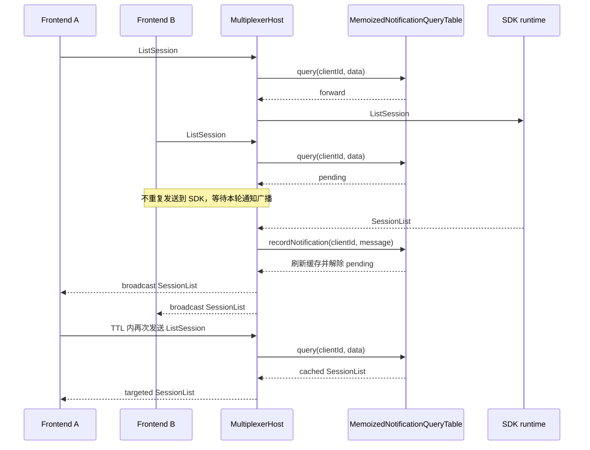

# DebugRouter Multiplexer 技术方案

## 1. 背景

`debug_router` SDK 侧的连接模型仍然是单前端独占：native 侧只保存一个当前 transceiver 或 USB client，新连接会替换旧连接。Lynx DevTool MCP、VSCode 插件等多个 DevTool 前端如果都直接通过 `debug_router_connector` 连接同一个 SDK runtime，就会出现后启动前端抢走连接、旧前端断开的现象。

Multiplexer 的当前实现把“多前端并发”收敛到 `debug_router_connector` 内部：本机只保留一个 detached daemon 持有真实设备和 SDK runtime 连接，所有 connector 进程和 WebSocket frontend 都通过这个 daemon 共享同一条物理通道。

## 2. 术语、用法与目标

### 2.1 阅读指引

这份文档用于帮助快速建立代码结构和调用流程的上下文。建议优先阅读：

1. `4. 整体架构`：看清 connector 进程、daemon、WebSocket frontend 和 SDK runtime 的边界。
2. `5. 公开 DebugRouterConnector facade`、`6. daemon 发现、启动与替换`：理解普通接入方如何自动复用 daemon。
3. `10. WebSocket frontend 路径`、`11. Message ID 重写、路由与通知查询记忆化`：理解多前端并发时如何做来源隔离、定向回包和重复查询合并。
4. `12. 旧多开 owner 兼容`、`13. 容灾、恢复和退出`：理解旧 `LatestDriverProcess` 兼容、daemon 崩溃和 idle 退出。

当前实现的重点边界是：公开 `DebugRouterConnector` 已是 Multiplexer facade；真实物理连接和 WebSocket 连接都在 daemon 内；connector 侧按当前 facade 请求的资源持有 device、USB runtime、WiFi runtime 和 WebSocket frontend 镜像。

### 2.2 术语

| 名称                      | 含义                                                                                                                                                                                        |
| ------------------------- | ------------------------------------------------------------------------------------------------------------------------------------------------------------------------------------------- |
| debug_router SDK          | SDK 侧 DebugRouter 组件，负责接收前端调试消息并返回 SDK runtime 事件和响应。                                                                                                                |
| debug_router_connector    | PC 侧 DebugRouter 连接库，负责设备发现、连接 SDK runtime，并向 Lynx DevTool/浏览器调试页面提供 WebSocket 调试入口。                                                                         |
| DebugRouter Multiplexer   | connector 内部的本地多路复用机制，由 daemon 统一持有真实设备和 SDK 连接，并为多个前端做消息隔离、id 重写和定向回包。                                                                        |
| Multiplexer daemon        | 本机 detached 共享进程，负责真实物理连接、control server、WebSocket server、snapshot/event 广播和路由。                                                                                     |
| 记忆化通知查询            | 一类无 id 的 `Customized` 查询，其 runtime 回复是 SDK 主动通知。daemon 可以合并重复查询，并在同一 runtime client 上短暂复用最新通知。                                                       |
| control client            | 普通 connector 进程通过 control WebSocket 连接 daemon 后形成的 daemon client。                                                                                                              |
| WebSocket Driver frontend | type 为 `Driver` 的 WebSocket 前端页面。                                                                                                                                                    |
| runtime client            | SDK runtime 对应的调试目标，包括 USB runtime client 和作为 WebSocket app client 接入的 WiFi runtime。daemon 统一跟踪两类 runtime，并向请求 WebSocket 服务的 facade 同步 WiFi runtime 镜像。 |

### 2.3 接入方用法

对 Lynx DevTool MCP、VSCode 插件等接入方而言，Multiplexer 是 `debug_router_connector` 内部能力。接入方仍按原方式创建和使用 `DebugRouterConnector`：

```ts
const connector = new DebugRouterConnector(options);
```

原有设备发现、runtime client 连接、消息发送和事件订阅接口保持兼容：

```ts
connector.on("device-connected", (device) => {
  // 复用原有处理逻辑
});

connector.on("client-connected", (client) => {
  // 复用原有处理逻辑
});

const devices = await connector.connectDevices();
const clients = await connector.connectUsbClients(deviceId);
```

普通 connector 进程不会再直接持有真实 SDK 连接，而是自动发现或拉起本机 Multiplexer daemon，并通过 daemon 访问真实设备和 runtime。接入方只需要升级到包含 Multiplexer 能力的 `debug_router_connector` 版本，并继续使用原有 `DebugRouterConnector` API。

### 2.4 目标

1. SDK 侧仍然只看到一个真实 DevTool 前端连接，不要求 SDK native 支持多 frontend。
2. 多个 `DebugRouterConnector` 实例、Lynx DevTool 页面和其他上层工具可以同时存在，并复用同一个本地 daemon。
3. 公开 `DebugRouterConnector` API 尽量保持原有调用习惯：设备和 runtime client 通过本地镜像对象与事件暴露给接入方，WebSocket server 仍保留原路径和兼容字段。
4. 对 CDP/App request-response 做 message id 隔离，避免不同前端使用相同 id 时串包。
5. 合并重复的无 id 状态查询，同时不改变 SDK 通知格式，也不抑制原有通知广播。
6. daemon 崩溃、协议升级、空闲退出和旧多开 owner 被抢占时有可恢复路径。

### 2.5 非目标

1. 不修改 SDK native 侧的单连接模型。

### 2.6 方案取舍

另一个方案是在 SDK 侧直接支持多前端连接和消息分发。当前实现选择 connector 内 Multiplexer，原因是改动边界更可控，接入方升级成本更低，也便于灰度和回滚。代价是本地链路多了一次 connector 到 daemon 的跨进程转发，并需要额外维护 daemon 的发现、生命周期和排障链路。

| 方案                     | 优点                                                          | 缺点                                                                                        |
| ------------------------ | ------------------------------------------------------------- | ------------------------------------------------------------------------------------------- |
| connector 内 Multiplexer | 不改 SDK native；接入方只需升级 connector；灰度和回滚更可控。 | 多一层本地转发；daemon 生命周期和问题排查多一层。                                           |
| SDK 侧支持多前端         | 链路更短，连接模型更直接。                                    | native 改造面更大；依赖业务发版覆盖；回滚更困难；SDK 侧也需要新增分发、生命周期和兼容逻辑。 |

## 3. 当前代码边界

公开 facade：

- `debug_router_connector/src/connector/DebugRouterConnector.ts`
- `debug_router_connector/src/connector/index.ts`
- `debug_router_connector/src/index.ts`

connector 侧 daemon client 与镜像对象：

- `debug_router_connector/src/multiplexer/client/MultiplexerDaemonClient.ts`
- `debug_router_connector/src/multiplexer/client/MultiplexerDaemonManager.ts`
- `debug_router_connector/src/multiplexer/client/MultiplexerDiscovery.ts`
- `debug_router_connector/src/multiplexer/client/MultiplexerDevice.ts`
- `debug_router_connector/src/multiplexer/client/MultiplexerUsbClient.ts`
- `debug_router_connector/src/multiplexer/client/MultiplexerWebSocketClient.ts`

daemon 侧：

- `debug_router_connector/src/multiplexer/daemon/entry.ts`
- `debug_router_connector/src/multiplexer/daemon/MultiplexerDaemon.ts`
- `debug_router_connector/src/multiplexer/daemon/MultiplexerHost.ts`
- `debug_router_connector/src/multiplexer/daemon/MultiplexerControlServer.ts`
- `debug_router_connector/src/multiplexer/daemon/MultiplexerControlConnection.ts`
- `debug_router_connector/src/multiplexer/daemon/MemoizedNotificationQueryTable.ts`
- `debug_router_connector/src/multiplexer/daemon/PendingRouteTable.ts`
- `debug_router_connector/src/multiplexer/daemon/LegacyOwnershipGuard.ts`

协议和工具：

- `debug_router_connector/src/multiplexer/protocol/control.ts`
- `debug_router_connector/src/multiplexer/protocol/discovery.ts`
- `debug_router_connector/src/multiplexer/protocol/event.ts`
- `debug_router_connector/src/multiplexer/protocol/snapshot.ts`
- `debug_router_connector/src/multiplexer/protocol/validation.ts`
- `debug_router_connector/src/multiplexer/utils/paths.ts`
- `debug_router_connector/src/multiplexer/utils/FileLock.ts`
- `debug_router_connector/src/multiplexer/utils/atomic_file.ts`

WebSocket 与物理层：

- `debug_router_connector/src/websocket/WebSocketServer.ts`
- `debug_router_connector/src/websocket/WebSocketConnection.ts`
- `debug_router_connector/src/physical/PhysicalConnector.ts`

当前 `src/connector` 目录只导出新的 `DebugRouterConnector` facade，没有 `LegacyDebugRouterConnector` 公开实现。

## 4. 整体架构

### 4.1 进程视图

```text
接入方进程
  DebugRouterConnector
    MultiplexerDaemonClient
      ws://127.0.0.1:<controlPort>/debug-router-multiplexer/control
        Multiplexer daemon
          MultiplexerHost
            PhysicalConnector
              SDK runtime / device

WebSocket frontend
  ws://<host>:<wssPort>/mdevices/page/android
    daemon 内 WebSocketController
      MultiplexerHost
        USB SDK runtime / WiFi SDK runtime / device
```

connector 进程不再直接持有真实设备 watcher 或 SDK runtime/WebSocket 连接。USB 物理连接只存在于 daemon 内的 `MultiplexerHost -> PhysicalConnector`，WiFi runtime 和 Driver frontend 连接由 daemon 内的 `WebSocketController` 持有。connector 进程维护本地 `MultiplexerDevice`、`MultiplexerUsbClient` 和 `MultiplexerWebSocketClient` 镜像；WebSocket 镜像和事件只暴露给调用过 `startWSServer()` 的 control clients。

### 4.2 本地状态目录

默认目录是：

```text
~/.DebugRouterConnector/multiplexer/
  spawn.lock
  daemon.lock
  daemon.json
```

可通过 `multiplexerRootDir` 或 `multiplexerDataDir` 覆盖路径，主要用于测试、隔离运行或特殊打包场景。

`daemon.json` 的当前结构由 `MultiplexerDiscoveryInfo` 定义：

```ts
type MultiplexerDiscoveryInfo = {
  pid: number;
  protocolVersion: number;
  minSupportedProtocolVersion?: number;
  controlPort: number;
  heartbeat: number;
  startedAt?: number;
  daemonVersion?: string;
  capabilities?: string[];
};
```

`spawn.lock` 用于抢占 daemon 启动权，只在 connector ensure daemon 的启动窗口内持有。`daemon.lock` 由 daemon 进程持有，表示当前 daemon owner。`daemon.json` 由 daemon 在 control server 启动后写入，并按 heartbeat 周期刷新。写入通过 `writeJsonAtomic()` 完成，避免其他进程读到半截 JSON。

## 5. 公开 `DebugRouterConnector` facade

`DebugRouterConnector` 构造时创建：

1. `MultiplexerDiscovery`，负责读取和校验 `daemon.json`。
2. `MultiplexerDaemonManager`，负责 ensure、spawn、replace、health check 和 stale cleanup。
3. `MultiplexerDaemonClient`，负责连接 daemon control WebSocket、发送 RPC、接收事件。
4. 本地 `DriverClient`，以及 device、USB runtime、WiFi runtime 和 WebSocket frontend 镜像 Map。facade 不再创建或持有 connection trace recorder。

如果 `manualConnect` 为 false，构造函数会自动调用 `connectDevices()`。Host 会在 `connectDevices()` 和 `startWatchAllClients()` 内部重新获取旧 `LatestDriverProcess` ownership，因此 desired-state 恢复可通过现有 RPC 一并恢复 ownership 和物理 watcher，不再需要单独的 `reacquireLegacyOwnership` RPC。

公开 facade 的当前行为：

- `connectDevices()` 通过 control RPC 让 daemon 启动物理设备发现，并把返回 snapshot upsert 成本地 `MultiplexerDevice`。
- `connectUsbClients()` 通过 daemon 启动指定 device 的 runtime client watcher，并把返回 snapshot upsert 成本地 `MultiplexerUsbClient`。
- `getDevices()`、`getDeviceUsbClients()`、`getAllUsbClients()` 从本地镜像读取，必要时等待本地事件。
- `startWSServer()` 通过 daemon 启动 WebSocket server，并把返回的 `WebSocketServerInfo` 同步成本地兼容字段 `wssPort`、`wssHost`、`roomId`、`wss.wssPath`。
- facade 调用 `startWSServer()` 后成为 WebSocket 状态 requester：Host 会向它定向同步当前及后续 WebSocket snapshot，并发送 source 为 `websocket-runtime` 或 `websocket-driver` 的 `client-message`；未请求 WebSocket 服务的 facade 不消费这些状态。
- `getAllWebsocketAppClients()` 和 `getAllAppClients()` 通过 `MultiplexerWebSocketClient` 代理继续暴露 WiFi runtime；代理的发送和关闭操作会转成 daemon RPC。
- `sendMessageToWeb()`、`sendMessageToApp()` 仍保留原调用方式，但实际转发给 daemon。
- `disableAllClients()` 和 `addDeviceManager()` 在 Multiplexer-only facade 中不再操作物理对象，只记录 warning。
- `close()` 只关闭当前 connector 的 control socket、取消订阅并清理本地镜像，不直接关闭 daemon。daemon 是否退出由 idle timeout 或 shutdown/replacement 流程决定。

daemon control socket 断开时，facade 会清空本地镜像、reject 未完成 RPC、按 100ms 延迟调度 desired-state 恢复：重新连接 daemon、恢复设备发现、恢复 `startWatchAllClients()` 和已请求的 WebSocket server。

## 6. daemon 发现、启动与替换

`DebugRouterConnector` 将部分行为转发给 Daemon 时会调用函数 `MultiplexerDaemonClient.call()`。 `MultiplexerDaemonClient.call()` 会先执行 `connect()`；`connect()` 通过 `MultiplexerDaemonManager.ensureDaemon()` 获得可用 daemon。

`MultiplexerDiscovery.validateDiscovery()` 的校验顺序：

1. `daemon.json` 缺失、JSON 非法或 shape 非法时返回 unusable。
2. 缺少 `protocolVersion` 时返回 unusable。
3. heartbeat 超过 `multiplexerStaleTimeout` 时返回 stale。
4. connector 协议低于 daemon 的 `minSupportedProtocolVersion` 时返回 `connector-protocol-too-old`。
5. daemon 协议低于 connector 协议时返回 `replace-required`。
6. 其余 compatible 情况返回 usable。

默认协议常量当前是：

```text
MULTIPLEXER_PROTOCOL_VERSION = 1
MULTIPLEXER_MIN_SUPPORTED_PROTOCOL_VERSION = 1
```

`MultiplexerDaemonManager` 对校验结果的处理：

- usable：先访问 `http://127.0.0.1:<controlPort>/health`；health ok 才复用。
- usable 但 health 暂时失败：如果 pid 仍存活，按 `readyPollInterval` 重试 3 次。
- `replace-required`：抢 `spawn.lock`，优先通过 `shutdownDaemon` RPC 请求旧 daemon 主动退出；如果未退出，再 SIGTERM/SIGKILL；随后清理 `daemon.lock` 和 `daemon.json` 并拉起新 daemon。
- connector 协议过旧：抛出升级错误，不清理、不杀掉新版 daemon。
- stale、invalid 或 missing：抢 `spawn.lock` 后执行 cleanup。若 discovery 中 pid 存活会强制停止；若 `daemon.lock` owner 仍存活且不是刚停止的 pid，也会按 lock owner 停止；最后清理本地 artifact 并 spawn。

关键默认值：

```text
startupTimeout = 5000ms
readyPollInterval = 100ms
replacementTimeout = 1000ms
healthCheckTimeout = 500ms
spawnLockStaleTimeout = startupTimeout + replacementTimeout + 1000ms
```

spawn 使用当前 Node 可执行文件 detached 启动 `multiplexer/daemon/entry.js`，`stdio: "ignore"`，随后 `unref()`。启动参数会传入 discovery/lock 路径、协议版本、control port、heartbeat、daemonVersion、capabilities、legacy driver dir、idle timeout、WebSocket 配置和 daemon 侧 `PhysicalConnectorOption`。

## 7. daemon 进程与 Host

`entry.ts` 负责解析 daemon 参数、创建 `MultiplexerHost` 和 `MultiplexerDaemon`，并注册 `beforeExit`、`SIGINT`、`SIGTERM`、`uncaughtException`、`unhandledRejection` 清理逻辑。清理会调用 `daemon.stop()`；强制退出路径最多等待 3000ms。

`MultiplexerDaemon.start()` 的流程：

1. 抢占 `daemon.lock`。
2. 启动 `MultiplexerHost`。
3. 读取 Host 实际 control port。
4. 写入 `daemon.json`。
5. 启动 heartbeat timer，默认每 1000ms 刷新一次 discovery heartbeat。

`MultiplexerDaemon.stop()` 的流程：

1. 停止 heartbeat timer。
2. 停止 Host。
3. 删除 `daemon.json`。
4. 释放 `daemon.lock`。

`MultiplexerHost` 是 daemon 内部核心对象，负责：

- 持有真实 `PhysicalConnector`。
- 启动 control server，提供 `/health` 和 `/debug-router-multiplexer/control`。
- 启动 WebSocket server，继续使用 `/mdevices/page/android`。
- 管理 device watcher、runtime client watcher 和 WebSocket client。
- 序列化 snapshot 并广播 control event。
- 处理 message id 重写、pending route 和回包归属。
- 通过 `MemoizedNotificationQueryTable` 合并无 message id 的通知型查询，并定向返回新鲜缓存。
- 维护旧 `LatestDriverProcess` owner 状态。
- 管理 idle timeout 和 shutdown handler。

## 8. control 协议

### 8.1 RPC

control RPC 当前由 `ControlRpcMethod` 定义：

| RPC                        | 作用                                                                      |
| -------------------------- | ------------------------------------------------------------------------- |
| `connectDevices`           | 启动物理设备发现，返回设备 snapshot                                       |
| `connectUsbClients`        | 启动指定设备的 runtime client watcher，返回 client snapshot               |
| `startWatchClient`         | 启动指定设备的 runtime client watcher                                     |
| `stopWatchClient`          | 停止指定设备的 runtime client watcher，但不主动断开设备                   |
| `disconnectDevice`         | 断开指定 device                                                           |
| `shutdownDaemon`           | 请求 daemon 主动停止，用于 replacement/yield                              |
| `startWSServer`            | 在 daemon 内启动 WebSocket server                                         |
| `startWatchAllClients`     | 启动当前及后续设备的 runtime client watcher                               |
| `stopWatchAllClients`      | 停止全部 watcher，并关闭后续设备的自动 watcher                            |
| `sendRawMessage`           | 透传原始 request-response 消息到 `PhysicalConnector.sendRawMessage`       |
| `sendMessage`              | 统一发送到 App runtime、指定 Web Driver 或全部 Web Driver                 |
| `closeClient`              | 关闭指定 runtime client                                                   |

单设备 watcher 使用独立的 `startWatchClient({ deviceId })` 与 `stopWatchClient({ deviceId })`，`deviceId` 必须非空。全部设备 watcher 使用 `startWatchAllClients({ force? })` 与 `stopWatchAllClients({})`；停止全部 watcher 后，显式调用任一 start RPC 可以再次开启。`sendMessage` 固定使用 `{ target: "app" | "web", clientId, message }`；`target: "web"` 时 `clientId: -1` 表示广播，App 不支持 `-1`。

RPC 请求和响应都带 `kind`、`id`，请求可带 `meta.protocolVersion`、`clientVersion`、`capabilities`。`MultiplexerDaemonClient` 默认 RPC 超时是 5000ms。RPC 的 operation `timeout` 为正数时，实际超时取 `max(rpcTimeout, timeout + 1000ms)`；没有 operation timeout 时继续使用默认 RPC 超时，不按 method 做特殊判断。

### 8.2 Event

`ControlEvent` 类型当前定义了：

```text
snapshot
legacy-ownership-changed
client-message
```

每个 control 连接建立后，Host 会先向该 control id 发送一次 `snapshot`。物理 device、USB runtime、WebSocket runtime 和 WebSocket Driver 的生命周期变化全部通过新 snapshot 表示，不再发送独立生命周期 ControlEvent；Connector 对连续快照做差分并在本地发出兼容公开事件。连接按 device 先于 runtime 的依赖顺序上报，同一快照批量移除时 runtime/WebSocket Client 先于 device。

runtime 路由策略不区分 transport：USB/WiFi 共用 id 恢复、route lookup、定向回包、未知 response 丢弃和 notification 广播逻辑。所有消息统一使用 `client-message`，通过 `source: "usb-runtime" | "websocket-runtime" | "websocket-driver"` 区分来源。WebSocket snapshot 和消息只对请求过 `startWSServer` 的 facade 可见；复用共享 WebSocket server 时，Host 会立即向 requester 补发最新定向 snapshot。

Connection trace 完全由 daemon 持有，不属于 `snapshot` 或 control 协议。`MultiplexerHost` 是唯一 owner：它只根据 `connectionTrace` 创建 `ConnectionTraceRecorder`，把同一实例传给自己创建的 `PhysicalConnector`，记录整条链路的连接事实，并负责关闭 recorder；不会复用注入 `PhysicalConnector` 上或外部 `traceRecorder` option 中的 recorder。除旧版已有的 device、runtime 和 WebSocket client 连接事实外，Host 还会记录 daemon 启停与关闭触发原因、control socket 建连/断连、共享 WebSocket server 启停，以及 legacy ownership 获取/丢失；control socket 事件携带 `controlId` 和变化后的活动连接数，server 与 ownership 事件携带对应端点或 owner 元数据。Connector facade 不再提供 `getConnectionTrace()` 或 `onConnectionTrace()`，daemon 也不提供 trace 查询、订阅 RPC 或 trace control event。Recorder 自身已有的 buffer、listener 和查询能力暂时保留为 daemon 内部能力，但不跨进程暴露。

Trace 配置是 daemon 启动级全局配置。真正首次启动 daemon 的 Connector 决定 `connectionTrace`；后续 Connector 只会复用已有 daemon，在 daemon 重启前不能替换 recorder 配置。daemon 仍按照原 `ConnectionTraceOptions` 规则结合 `process.env.DriverConnectionTracePath` 构造 recorder，因此 option 和环境变量均未提供 output 时默认不启用。字符串形式的 `connectionTrace.output` 会先转成绝对路径，再序列化给 daemon；`WritableStream` 对进程内 `PhysicalConnector` 仍然有效，但无法跨 Multiplexer 进程边界，因此 facade 会忽略该 output、输出 warning，并继续传递其他 trace options。`MultiplexerDaemonManager` 会在 daemon 启动参数序列化前明确移除 `traceRecorder`，daemon entry 也会拒绝人为传入的 recorder 实例。

`DebugRouterConnector.applyHostEvent()` 会把 snapshot 同步到本地镜像，并将统一 `client-message` 的 source 映射回 `usb-client-message`、`ws-client-message`、`ws-web-message` 等兼容公开事件；Connector 对外事件面保持不变。

## 9. connector 侧镜像对象

`MultiplexerDevice` 是 connector 进程内的设备代理对象。它保存 daemon snapshot，并通过 RPC 操作 daemon 内真实 device：

- `startWatchClient()` -> `startWatchClient({ deviceId })`
- `stopWatchClient()` -> `stopWatchClient({ deviceId })`
- `disConnect()` -> `disconnectDevice`
- `getHost()` 默认返回 snapshot host，缺省时返回 `127.0.0.1`

`MultiplexerUsbClient` 是 connector 进程内的 runtime client 代理对象。它保留原 `Client` 接口习惯：

- `clientId()`
- `deviceId()`
- `close()`
- `sendCustomizedMessage()`
- `sendRawMessage()`
- `sendMessage()`
- `sendClientMessage()`
- `on()` / `once()` / `off()` / `onAllEvents()`

其中发送类方法都会转成 daemon RPC。`handleMessage()` 只处理 source 为 `usb-runtime` 的 `client-message`：CDP/App notification 会按 method 触发本地事件，request-response 回包由 daemon 侧 route 表处理。

`MultiplexerWebSocketClient` 是 connector 进程内对 daemon 真实 WebSocket client 的兼容代理。它从 `WebSocketClientSnapshot` 更新 `id`、`type` 和 `raw_info`，但不持有真实 socket；`sendMessage()`、`sendCustomizedMessage()` 和 `close()` 都通过 daemon RPC 操作真实 WiFi runtime。Driver 类型的代理还保留 `handleListClients()` 行为，用 facade 当前的 WiFi/USB 镜像生成兼容 `ClientList`。

本地镜像同步规则：

1. 收到 `snapshot` 时，先 upsert device、USB client Map；对于请求过 WebSocket 服务的 facade，同时 upsert WebSocket app/frontend Map。
2. 对比前后快照，对新增对象发出兼容连接事件。
3. 对缺失对象按 runtime/WebSocket Client 先于 device 的依赖顺序删除并发出兼容断开事件。
4. 收到 `client-message` 时，根据 source 映射到对应兼容消息事件面。
5. daemon control socket 断开时清空 device、USB client 和已缓存的 WebSocket client 镜像，并调度 desired-state 恢复。

## 10. WebSocket frontend 路径

`WebSocketController` 已从具体 `DebugRouterConnector` 类解耦，依赖结构化 `WebSocketControllerHost`。在 Multiplexer 当前实现里，这个 host 是 daemon 内的 `MultiplexerHost`。

`startWSServer` RPC 在 daemon 内执行：

1. 根据 `websocketOption.port` 或默认 `19783` 选择端口，使用 `detect-port` 避免冲突。
2. 使用 `ip.address()` 生成 host，返回 `WebSocketServerInfo`。
3. 创建 `WebSocketController`，监听 `/mdevices/page/android`。

启动后，即使所有请求过该服务的 controls 都断开，共享 WebSocket server 也会保持运行。移除 requester 只会停止向该 control 同步 snapshot/event；server 仅在 daemon idle 退出、显式 shutdown 或 replacement 时随 daemon `stop()` 一起关闭。

WebSocket client 握手流程：

1. server 分配 client id，发送 `Initialize`。
2. client 回 `Register`，携带 type 和 info。
3. type 为 `Driver` 的连接放入 `webClients`，代表 WebSocket Driver frontend。
4. 其他 type 放入 `websocketAppClients`，代表 WiFi app client。
5. Host 收到连接/断开通知后维护 `activeWebSocketDriverIds`，用于 idle 判断；同时只向请求过 `startWSServer` 的 control clients 定向同步生命周期事件和最新 WebSocket snapshot。

消息路径：

- Driver frontend 发 `Customized` 到目标 runtime：`WebSocketClient` 取出目标 `client_id`，调用 `WebSocketController.sendMessageToApp(id, message, fromWebClientId)`，再进入 `MultiplexerHost.handleWebSocketMessage()`；Host 按 client id 选择 WebSocket app client（WiFi）或 `PhysicalConnector.usbClients`（USB）。
- WebSocket app client 发消息到 frontend：`WebSocketClient` 调用 `handleWebSocketAppMessage()`，Host 再交给 transport-independent 的 `handleRuntimeMessage(appClientId, message, "websocket-runtime")`；WiFi/USB 共用路由逻辑，并保留明确的消息 source。
- `ClientList` 由 Driver frontend 触发，返回当前 WebSocket app clients 和 USB runtime clients；USB runtime client 会带 `network: "USB"`，WebSocket app client 会带 `network: "WiFi"`。

`sendMessageToWebClient(webClientId, message)` 用于把命中的 request-response 回包只发回原始 Driver frontend；`sendMessageToWeb(message)` 用于 SDK 主动事件广播。

当前实现边界：

- `WebSocketController` 仍保留“未带 `fromWebClientId` 时直接发给 `websocketAppClients`”的兼容分支。
- 在 daemon 当前路径中，Driver frontend 发起的 `Customized` 会带 `fromWebClientId`，因此进入 Host 统一路由。
- Host 统一出站路由同时支持 `PhysicalConnector.usbClients` 和 `WebSocketController.websocketAppClients`，两类 runtime 共用 message id 重写、pending route 和定向回包逻辑。
- Driver frontend client 永远不是 control `sendMessage`、`sendCustomizedMessage` 或 `closeClient` RPC 的合法 runtime 目标。runtime lookup 只检查 WebSocket app clients 和 USB clients，因此即使 Driver/app client id 重复，也不会把 runtime 操作误发给 Driver。
- runtime `Customized` 消息以已注册的 WebSocket app client id 为准，因此 payload 缺少 `sender` 时仍会进入统一路由；该分支不会在 `WebSocketClient` 中提前重复发出消息，而是由 Host 对路由结果或广播结果只发出一次。非 `Customized` runtime 消息和 Driver 消息使用 requester-scoped `client-message`，由 source 区分。
- WebSocket 解析或路由异常由 client handler 捕获并记录，不会向外抛出或主动关闭 socket。连接关闭时 controller 还会核对来源 client 实例后再删除 Map 项，避免数字 id 相同的 WiFi runtime 与 Driver frontend 互相误删。
- WebSocket app client 会出现在 `ClientList` 中，并通过 snapshot 和生命周期事件同步给请求 WebSocket 服务的 Connector facade。Driver 到 WiFi、Connector 到 WiFi、定向回包、原始事件、断开清理和 late-requester snapshot 恢复均已有 integration/E2E 测试覆盖。

## 11. Message ID 重写、路由与通知查询记忆化

### 11.1 带 message id 的 request-response 路由

不同 frontend 可能同时发送相同 CDP/App id，例如都发送：

```json
{ "id": 1, "method": "Runtime.enable" }
```

SDK response 只会带 message id，不会带 control id 或 WebSocket client id。因此 Host 在消息发往 runtime 前必须把原始 id 改写成全局唯一 id，并记录回包目标。

`PendingRouteTable` 当前 route 结构：

```ts
type PendingControlRoute = {
  kind: "control";
  globalMessageId: number;
  controlId: number;
  originalId: number;
  clientId: number;
  createdAt: number;
  resolve?: (value: unknown) => void;
  reject?: (error: Error) => void;
};

type PendingWebSocketRoute = {
  kind: "websocket";
  globalMessageId: number;
  webClientId: number;
  originalId: number;
  clientId: number;
  createdAt: number;
};
```

route 默认超时 10000ms。control route 超时时会 reject 对应 Promise；WebSocket route 超时只删除映射。

出站处理：

1. Host 解析外层 JSON。
2. 忽略 `UsbConnect` 和 `UsbConnectAck`。
3. 如果 `data.data.client_id` 为非 0/truthy 值，发往 runtime 前统一改成 `-1`。
4. 从 `data.data.message` 中识别 Customized payload，兼容 message 是字符串或对象两种形态。
5. 只有 payload 中存在安全整数 `id` 时才建立 pending route。
6. Host 分配 `globalMessageId`，把原始 id 改成全局 id，写入 `PendingRouteTable`。
7. 按目标 client id 调用真实 `WebSocketClient.sendMessage()`（WiFi）或 `UsbClient.sendMessage()`（USB）发给 SDK runtime。

入站处理：

1. Host 收到 runtime 消息后解析 Customized payload。
2. 如果 payload 中有安全整数 id，先按全局 id 从 `PendingRouteTable` 中 `take()` route。
3. 命中 route 时，把 id 改回 frontend 原始 id，并把 sender/client_id 改回真实 runtime client id。
4. control route 如果带 `resolve`，说明来自 `sendCustomizedMessage()`，直接 resolve 被提取出的 Customized 内层 message；否则向指定 control 定向发送 `client-message`，source 为 `usb-runtime` 或 `websocket-runtime`。
5. WebSocket route 通过 `sendMessageToWebClient(webClientId, message)` 只发回原始 Driver frontend。
6. 如果消息带 response id 但没有命中 route，直接丢弃，避免回包泄漏给其他 frontend。
7. 如果消息没有 response id，视为 SDK 主动事件：改写 runtime client id 后广播给 WebSocket Driver frontend，并向 controls 广播带对应 runtime source 的 `client-message`。

route 清理：

- control socket 断开时，`clearByControlId(controlId)` 并 reject control route。
- WebSocket frontend 断开时，`clearByWebClientId(webClientId)`。
- Host physical discovery reset 或 legacy owner 丢失时，清空全部 route。

### 11.2 无 message id 的通知型查询记忆化

#### 11.2.1 问题与消息范围

部分 frontend 请求没有 `data.data.message`，因此也没有可供 `PendingRouteTable` 改写和定向的 `message.id`。其中 `ListSession` 到达 SDK 后会让 SDK 另行发送一条 `SessionList` 通知：

```text
frontend -- ListSession --> SDK runtime
frontend <-- SessionList -- SDK runtime
```

`SessionList` 是独立通知而不是带相同 id 的 response。按照普通 SDK 主动事件的广播规则，一次通知会发给所有 WebSocket Driver frontend 和 control clients。如果 30 个 frontend 同时发送 `ListSession`，SDK 会生成 30 条 `SessionList`，每条又广播给 30 个 frontend，最终触发 900 次订阅处理，消息量呈平方增长。在真机压力测试中，20 个 connector 同时发送 `ListSession` 曾导致手机侧因内存压力崩溃。

解决策略是对这类请求做记忆化查询：Host 记录 SDK 最近一次发出的 `SessionList`。frontend 再次发送 `ListSession` 时，如果存在未过期缓存就直接定向返回，不再访问 SDK；如果没有缓存，只转发短时间窗口内到达的第一条查询，其余查询合并到同一个 pending 状态，等待 SDK 通知按原路径广播。这样既避免广播风暴，也不改变 SDK 通知格式和首次通知的广播语义。

当前对 SDK native `Processor::process()` 和 Customized 协议解析分支的审计结果如下：

| 请求类型                                         | SDK 侧结果                                                    | 是否纳入记忆化                              |
| ------------------------------------------------ | ------------------------------------------------------------- | ------------------------------------------- |
| `ListSession`                                    | 立即调用 `FlushSessionList()`，另行发送 `SessionList` 通知    | 是                                          |
| `CDP` / extension                                | 消息体包含 request-response id，或本身是主动 notification     | 否，继续使用 `PendingRouteTable` 或普通广播 |
| `App`                                            | 协议解析明确要求内层 `message.id`，SDK response 复用该 id     | 否，继续使用 `PendingRouteTable`            |
| `OpenCard`                                       | 单向调用 SDK global handler，不生成配对通知                   | 否                                          |
| `D2RStopAtEntry` / `D2RStopLepusAtEntry`         | 单向传给 SDK message handler，不在该分支生成配对通知          | 否                                          |
| `Registered` / `RoomJoined` / `ChangeRoomServer` | 连接握手和房间协议，不是 frontend 到 runtime 的通知型查询路径 | 否                                          |

因此当前声明式映射只有：

```text
ListSession -> SessionList
```

后续如果出现相同语义的新消息，只需要在 `MemoizedNotificationQueryTable` 的 definition 中增加请求类型和通知类型映射，不需要把消息特例重新写进 Host。

#### 11.2.2 模块职责与状态

`MemoizedNotificationQueryTable` 独立负责：

1. 根据 Customized 外层 `data.type` 判断请求是否属于记忆化查询。
2. 按 runtime client id 和 notification type 保存最近一次通知及接收时间。
3. 按 runtime client id 和 request type 保存正在等待 SDK 通知的查询及发送时间。
4. 返回 `not-memoized`、`forward`、`pending` 或 `cached` 决策。
5. SDK 通知到达时刷新缓存并解除对应 pending 状态。
6. runtime 发送失败、runtime 断开或 Host 状态重置时清理 pending/cache。

核心状态按 runtime client 隔离：

```ts
notifications: Map<clientId, Map<notificationType, {
  message: string;
  receivedAt: number;
}>>;

pendingQueries: Map<clientId, Map<requestType, sentAt>>;
```

不能只按消息类型保存全局缓存，否则 runtime A 的 `SessionList` 可能被错误返回给查询 runtime B 的 frontend。缓存中保存的是 Host 已完成真实 runtime client id 改写后的完整通知字符串，因此缓存命中时可以直接沿原 control 或 WebSocket frontend 通道发送。空的 `SessionList` 也是有效通知，和非空列表一样正常记忆化。

默认 TTL 是 1000ms，缓存和 pending 使用相同窗口：

- `now - receivedAt <= TTL`：缓存新鲜，返回 `cached`。
- `now - sentAt <= TTL`：已有查询等待 SDK，返回 `pending`。
- 超过 TTL：认为状态 stale，允许新的请求返回 `forward`。

缺失、负数或非有限 TTL 会回退到默认值；`0` 是有效配置。entry age 等于 TTL 时仍然新鲜，只有 `age > TTL` 才视为 stale。

pending 也必须具备超时恢复能力。如果 SDK 未发送预期通知或通知在链路中丢失，永久 pending 会导致后续所有 `ListSession` 都被忽略。

#### 11.2.3 Host 集成流程

frontend 消息发往 runtime 前：

1. Host 完成 JSON 解析和 `client_id` 归一化。
2. Host 调用 `MemoizedNotificationQueryTable.query(clientId, data)`，判断本次请求是否需要记忆化。
3. `not-memoized`：本次请求不在记忆化范围内，继续原 message id 重写和 runtime 发送流程。有效外层 JSON 与声明式映射无关、没有可识别的 `Customized` type 或 type 未配置时都会进入该分支；非法外层 JSON 在进入本表之前就会被拒绝。
4. `forward`：本次请求需要记忆化，但本地没有新鲜缓存或有效 pending；记录 pending，并只把这一条请求发给 SDK runtime。
5. `pending`：本地没有缓存，但之前的同类请求已经通过 `forward` 发给 SDK；不重复发送，等待 SDK 通知按原广播路径满足本轮所有请求方。
6. `cached`：存在已记忆且未过期的缓存；不访问 SDK，只把缓存通知定向发送给当前 control client 或 WebSocket frontend。
7. 如果真实 USB/WiFi runtime 的同步发送抛错，Host 调用 `handleSendFailure()` 立即解除 pending，使下一次请求可以重试。

SDK runtime 消息进入 Host 后：

1. 有有效 response id 的消息仍优先走 `PendingRouteTable`，本模块不参与。
2. 无 response id 的消息完成 runtime client id 改写。
3. Host 调用 `recordNotification(clientId, message)` 判断本次消息是否需要记忆化；命中当前已声明的 `SessionList` 时刷新缓存并解除 `ListSession` pending。
4. 当前这条 SDK 通知仍按统一逻辑广播：所有 Driver frontend 都会收到，controls 则收到带对应 runtime source 的 `client-message`，确保首次查询和查询合并期间的相关请求方都能收到结果。
5. 后续 TTL 内的新查询命中缓存时，只定向返回当前请求方，不再次广播。

对应时序为：



#### 11.2.4 生命周期清理

记忆化状态依附于 Host 当前持有的真实 runtime 连接，不能跨 runtime 生命周期复用：

- `client-disconnected`：调用 `clearClient(clientId)`，清除该 runtime 的缓存和 pending。
- physical discovery reset、legacy owner 丢失或 Host stop：调用 `clear()`。
- control client 或 WebSocket frontend 断开：不需要清除 runtime 缓存；缓存属于 runtime，不属于某一个 frontend。
- 单次 runtime 发送失败：只解除该 client/request type 的 pending，不清除其他 runtime 的缓存。

这套策略把 30 个同时到达的 `ListSession` 收敛为 1 次 SDK 查询和 1 次面向 30 个 frontend 的广播，即 30 次订阅处理；TTL 内后续单个查询各自收到一条定向缓存结果，不再形成 30 × 30 的广播风暴。

## 12. 旧多开 owner 兼容

Multiplexer 当前不再让每个 connector 进程竞争旧 `LatestDriverProcess`。旧 owner 文件只由 daemon 侧 `LegacyOwnershipGuard` 维护，用来兼容仍依赖旧多开 owner 的物理连接逻辑。

`LegacyOwnershipGuard.start()` 当前行为：

1. 如果 `DriverCloseMultiOpen=true`，直接进入 attached 状态，并发出 `daemon-started` 变更。
2. 否则创建 legacy driver dir，删除旧 `lockfile` 目录。
3. 写入 `LatestDriverProcess` 为 daemon pid。
4. 每 500ms 检查 owner 文件。

监控逻辑：

- owner pid 是当前 daemon：保持 attached。
- owner 文件缺失或非法：重新写当前 daemon pid。
- owner pid 不存活：重新写当前 daemon pid。
- owner pid 是另一个存活进程：daemon 进入 unattached，Host 调用 `handleLegacyOwnershipLost()`。

Host 丢失 legacy owner 后会：

1. 标记 `legacyOwnershipAttached = false`。
2. reject 并清空所有 pending route。
3. 停止物理发现和 device client watcher，并清除全部 device，因为 Host 此时已经失去对这些设备的控制权。
4. 主动关闭并移除全部 USB runtime client，同时清除 selected runtime。
5. 主动关闭并移除全部 WebSocket app/WiFi runtime client，但保留仍真实连接的 WebSocket Driver frontend。
6. 直接从这些权威 Map 生成 snapshot，并刷新 WebSocket `ClientList` / `DeviceList`：只保留仍真实连接的 Driver client，device 和 USB/WiFi runtime 均被清除。
7. 广播 `legacy-ownership-changed`，connector facade 转成 `MultiOpenStatus.unattached` 回调。

这里不再构造人为的空 snapshot，也不额外执行一套 ownership-loss 专用的镜像清理。Host 会先从 daemon 侧权威 Map 中清除 device 和 runtime，再把这些 Map 与保留的 Driver Map 一起序列化为 snapshot；WebSocket `ClientList` 读取的也是同一份 USB/WiFi runtime Map，facade 再以该 snapshot 对齐全部镜像。因此即使 WiFi runtime 与 Driver frontend 使用相同的数字 client id，`ClientList`、Host snapshot 和 facade 镜像也会收敛到同一份真实状态。

connector 后续调用 `connectDevices()`、`startWatchAllClients()` 或执行 desired-state 恢复时，Host 会在对应 `connectDevices` / `startWatchAllClients` RPC 内部重新声明 owner。这里不是回到旧 connector 实现，而是让 daemon 重新获得旧物理层需要的 owner 文件，也不再暴露单独的 ownership RPC。

## 13. 容灾、恢复和退出

### 13.1 daemon 崩溃或 control socket 断开

daemon 崩溃后，connector 的 control socket 会关闭。`MultiplexerDaemonClient.closeSocket()` 会 reject pending RPC，并通知连接状态 listener。`DebugRouterConnector` 收到 disconnected 后清空本地镜像，然后调度 desired-state 恢复。

恢复过程：

1. `daemonClient.connect()` 重新 ensure daemon。
2. 如果之前已经请求过设备发现，重新 `connectDevices(-1, null, isAutoListenClients)`。
3. 如果之前请求过 `startWatchAllClients()`，重新启动全量 runtime watcher。
4. 如果之前启动过 WebSocket server，重新 `startWSServer()`。

状态恢复以 daemon snapshot 作为最终收敛点。无论中间丢失了哪些增量事件，重连后的全量 snapshot 都会覆盖 connector 本地镜像。

| 状态                                              | 所有者                                     | 恢复方式                                                                                                                             |
| ------------------------------------------------- | ------------------------------------------ | ------------------------------------------------------------------------------------------------------------------------------------ |
| 真实设备连接                                      | daemon 内 `PhysicalConnector`              | daemon 重新扫描并广播 snapshot。                                                                                                     |
| 本地 device、USB runtime 和 WebSocket client 镜像 | connector facade                           | 由 snapshot 覆盖重建；WebSocket 部分仅对重新请求 `startWSServer()` 的 facade 恢复。                                                  |
| connector pending RPC                             | connector 内 `MultiplexerDaemonClient`     | control socket 断开时 reject，由调用方按原逻辑重试。                                                                                 |
| pending route                                     | daemon 内 `PendingRouteTable`              | request 生命周期内创建；control/WebSocket 断开、Host reset 或超时后清理。                                                            |
| 通知型查询缓存与 pending                          | daemon 内 `MemoizedNotificationQueryTable` | runtime 断开、Host reset 或 legacy owner 丢失时清理；超过 TTL 后允许重新查询。                                                       |
| WiFi runtime / WebSocket frontend 连接            | daemon 内 `WebSocketController`            | WebSocket 连接断开后由 app/frontend 重连；Driver 连接数用于 daemon idle 判断，requester-scoped snapshot/event 用于 facade 镜像恢复。 |

### 13.2 daemon 空闲自动关闭

公开 facade 默认传入：

```text
multiplexerDaemonIdleTimeout = 600000ms
```

Host 的 idle 判断只看两类上层消费者：

1. control WebSocket 连接，也就是 connector API 用户。
2. type 为 `Driver` 的 WebSocket frontend。

当两类连接都为 0 时，Host 启动 idle timer。timer 到期后调用 daemon 的 idle handler，daemon 执行 `stop()` 并让 entry 进程退出。idle 期间如果有新的 control 或 Driver frontend 连接进入，timer 会被取消。

WiFi runtime/app 连接不是 idle ownership 的使用方。手机通过 WiFi 建连、断连或持续保持连接都不会取消或重新启动 idle timer；只要没有 Connector control client 或 Driver frontend，daemon 就会在配置的 timeout 后退出，并在 `stop()` 中关闭共享 WebSocket server。

`multiplexerDaemonIdleTimeout` 为负数、非有限数字或在嵌入场景未设置时，Host 不启用 idle 自动关闭。

### 13.3 daemon replacement/yield

当 connector 发现 daemon 协议过旧或 daemon 不健康需要替换时，Manager 会优先通过 `shutdownDaemon` RPC 请求 daemon 主动停止。Host 收到后调用 shutdown handler，daemon 走 `stop()` 清理 heartbeat、discovery、lock、control server、WebSocket server 和 physical connector。只有 daemon 未按时退出时，Manager 才会尝试 SIGTERM/SIGKILL。

### 13.4 未知 response id

Host 收到带有效 response id、但 route 表中没有匹配项的 runtime 回包时，直接丢弃，不广播。这是为了避免某个前端的 request-response 回包泄漏给其他前端。

## 14. 配置与兼容性

公开 `DebugRouterConnectorOption` 当前新增或使用的 Multiplexer option：

| Option                         | 作用                                                        |
| ------------------------------ | ----------------------------------------------------------- |
| `multiplexerDaemonIdleTimeout` | daemon 空闲退出超时，facade 默认 600000ms                   |
| `multiplexerStartupTimeout`    | 等待 daemon ready 的超时时间，默认 5000ms                   |
| `multiplexerStaleTimeout`      | discovery heartbeat 判 stale 的超时时间，facade 默认 5000ms |
| `multiplexerRpcTimeout`        | control RPC 默认超时，默认 5000ms                           |
| `multiplexerRootDir`           | Multiplexer 根目录，默认 `~/.DebugRouterConnector`          |
| `multiplexerDataDir`           | Multiplexer 数据目录，优先级高于 root dir                   |
| `multiplexerDaemonEntry`       | daemon entry js 路径，测试或特殊打包场景使用                |
| `multiplexerLegacyDriverDir`   | 旧 `LatestDriverProcess` 所在目录                           |
| `websocketOption.port`         | daemon WebSocket server 期望端口，默认 19783                |
| `websocketOption.roomId`       | WebSocket `RoomJoined` 返回的 room id                       |

`MultiplexerHostOption.memoizedNotificationTtlMs` 控制 daemon 侧 pending/cache TTL，默认 1000ms。它是 Host 内部 option，用于嵌入场景和确定性测试，不是通过 daemon 启动链路传递的公开 `DebugRouterConnectorOption`。

原有 physical option 会传给 daemon 内的 `PhysicalConnector`，包括 `manualConnect`、`enableWebSocket`、`enableAndroid`、`enableIOS`、`enableHarmony`、`enableDesktop`、`enableNetworkDevice`、`adbHostPort`、`hdcHostPort`、`usbConnectOpt`、`networkDeviceOpt`，以及可序列化的 `connectionTrace` 字段。daemon entry 会校验 `connectionTrace.enabled` 必须为 boolean、`connectionTrace.output` 必须为字符串路径、`connectionTrace.bufferSize` 必须为非负有限数，并拒绝 recorder 实例。`reportService` 不传给 daemon 内 physical connector，facade 侧仍负责 report service 初始化。

当前公开 facade 不再把 `enableMultiplexer`、`enableProxy`、`proxyDaemonIdleTimeout`、`DEBUG_ROUTER_PROXY*` 作为兼容入口。接入方应使用 `multiplexer*` 命名。

协议兼容规则：

1. `daemon.protocolVersion === connector.protocolVersion`：直接复用。
2. `daemon.protocolVersion > connector.protocolVersion` 且 `connector.protocolVersion >= daemon.minSupportedProtocolVersion`：复用高版本 daemon，旧 connector 只调用自身已知 RPC 和事件。
3. `connector.protocolVersion < daemon.minSupportedProtocolVersion`：connector 拒绝接入并提示升级，不清理新版 daemon。
4. `daemon.protocolVersion < connector.protocolVersion`：connector 认为 daemon 过旧，走 replacement 流程。

## 15. 典型流程

### 15.1 第一个 connector 启动

1. facade 创建 discovery、manager 和 daemon client。
2. `connectDevices()` 触发 `daemonClient.connect()`。
3. manager 发现没有可用 daemon，抢 `spawn.lock`。
4. manager spawn detached daemon entry。
5. daemon 抢 `daemon.lock`，启动 Host/control server，写入 `daemon.json`。
6. connector 连上 control WebSocket，收到初始 `snapshot`。
7. facade 通过 `connectDevices` RPC 让 Host 启动物理设备发现。

### 15.2 后续 connector 启动

1. facade 读取已有 `daemon.json`。
2. discovery fresh 且 health ok，直接连接已有 control server。
3. 新 control 连接收到当前 snapshot。
4. 后续物理 device 和 USB runtime 生命周期变化由 daemon 以 snapshot 广播给所有 control clients。USB/WiFi runtime 共用处理策略，并发出带对应 source 的 `client-message`；WebSocket 生命周期状态只对请求过 `startWSServer()` 的 facade 可见。

### 15.3 Driver frontend 请求 runtime

1. facade 调用 `startWSServer()`，daemon 启动或复用共享 WebSocket server。
2. Driver frontend 以 type `Driver` 注册并进入 `webClients`；请求过 WebSocket 服务的 facade 同步对应 Driver 镜像。
3. Driver frontend 发送 `Customized`，携带目标 runtime `client_id`。
4. Host 按 client id 选择 USB 或 WiFi runtime，为 CDP/App id 分配全局 id，并记录 `webClientId + originalId + clientId`。
5. runtime 回包进入统一入站路径后，Host 命中 route，恢复原始 id 和真实 runtime client id。
6. Host 只把回包发给原始 Driver frontend，不会泄漏给其他 Driver 或 control client。

### 15.4 SDK 主动事件

1. USB 或 WiFi runtime 发出无 request id 的 CDP/App notification。
2. Host 识别为主动事件，改写 runtime client id。
3. 如果 WebSocket 已启用，Host 广播给所有 Driver frontend。
4. Host 对两种 transport 使用相同广播逻辑，并发出 source 为 `usb-runtime` 或 `websocket-runtime` 的 `client-message`。
5. connector facade 将 USB event 分发到对应 `MultiplexerUsbClient` 的本地事件系统；WiFi event 经 requester-state 过滤后通过 WebSocket event surface 暴露。

### 15.5 并发 `ListSession` 查询

1. 第一个 frontend 向某个 runtime client 发送 `ListSession`。Host 记录 pending query，并转发到 SDK runtime。
2. 其他 frontend 在 1000ms 内向同一 runtime 发送 `ListSession`。Host 合并这些查询，不再发送重复 runtime 消息。
3. runtime 发出 `SessionList`。Host 记录完成 client id 重写的通知、清除 pending 标记，并通过原有 WebSocket/control event 路径广播该通知。
4. 新 frontend 在缓存仍新鲜时再次发送 `ListSession`。Host 只向该 frontend 定向返回缓存的 `SessionList`。
5. TTL 到期后，下一次 `ListSession` 会重新转发到 runtime，以刷新缓存的 session 状态。

## 16. 验证覆盖

当前测试分层覆盖了本方案引入的主要行为：

| 层级                     | 当前覆盖                                                                                                                                                             |
| ------------------------ | -------------------------------------------------------------------------------------------------------------------------------------------------------------------- |
| Unit                     | Host 路由、WebSocket 解析/异常隔离、requester-scoped 镜像、`MultiplexerWebSocketClient`、connection trace ownership、client id 重复以及 ownership 丢失后的状态清理。 |
| Integration              | daemon 并发启动、版本替换、重连/snapshot 收敛、路由隔离、daemon idle 生命周期、daemon-owned connection trace、WiFi runtime 行为以及 legacy ownership 抢占/恢复。     |
| 无设备 package-entry E2E | 共享 daemon/facade 行为、WebSocket 路由、WiFi runtime 注册和代理 API、ownership 丢失时保留 Driver，以及 snapshot/`ClientList` 状态收敛。                             |
| 真机 USB E2E             | Android/iOS 设备发现、runtime watcher 恢复、request-response 路由、legacy ownership 抢占和 `real_device.js`、`real_device_stress.js` 中的压力/churn 流程。           |
| 真机 WiFi E2E            | `real_device_wifi.js` 覆盖 Android WiFi 注册、公开生命周期/镜像、Driver 和 Connector 双向回包、代理调用以及断开清理。                                                |

主要命令如下：

```bash
cd debug_router_connector
npm run test:multiplexer
npm run test:integration:multiplexer

cd ../test/e2e_test/connector_test
npm run test:multiplexer:without-device
npm run test:multiplexer:with-device
npm run test:multiplexer:with-device:wifi:android
```
